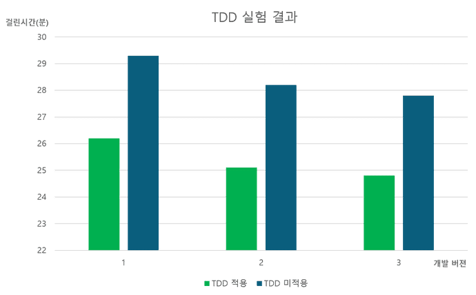

# 클린 아키텍쳐

> 프로그래머 로버트 C. 마틴의 1964~2016년간의 소프트웨어 제작 경험을 담은 책

> 빨리가는 유일한 방법은 제대로 가는 방법 밖에 없다

- 개발 조직이 할 수 있는 최고의 선택지는 조직에 스며든 문제를 인지하여 방지하고, 소프트웨어 아키텍처의 품질을 심각하게 고민하는 것이다
- 소프트웨어 아키텍처를 고민할려면 좋은 아키텍처가 무엇인지 이해해야한다
- 시스템 아키텍처들의 속성을 알고 있어야 한다
- 설계(design)와 아키텍쳐(architecture)의 차이를 구분해야한다
    - 설계(Design): 코드 단위, 모듈 레벨에서의 구조와 결정
    - 아키텍처(Architecture): 시스템 전체의 구조와 큰 설계 결정 (예: 계층 구조, 의존성 방향, 주요 컴포넌트 간 관계)

## 아키텍쳐
- 소프트웨어 아키텍처의 목표
    - 개발 비용 절감을 절감시키며 확장성(Scalability)과 변경 용이성(Maintainability)을 확보하는 것이 핵심
    - 적은 노력으로 변경할 수 있는 구조를 만드는 것이 핵심
- 좋은 아키텍처는 경영자와 개발자의 둘 모두의 시각에서 긍정적인 효과를 가지고 온다

### 실제 사례
> 적절하지 않은 아키텍쳐로 개발하여 출시한 어플리케이션의 경우 출시와 동시에 기능적으로 성공하여 많은 개발자를 채용하고 여러 기능을 추가하고자 한다 
> 하지만 예상과 다르게 문제가 발생하기 시작한다

- 처음에는 생산성이 좋지만 안 좋은 구조로 점점 많은 코드와 작업이 필요해진다
    - 처음에는 생산성이 높지만, 결국 개발에서 가장 많은 비용은 유지/보수에서 나가는데 이 곳에서 많은 비용이 지출되게 된다
    - 기능적 추가를 위해 개발자를 점점 더 고용하여 인건비는 늘어난다
- 결국 앱의 생산성은 점점 줄어들어 개발자는 작업이 많아지고 지불되는 인건비로 경영자도 불행해진다
- 때문에 항상 좋은 구조를 중요시 생각하여 개발하여야 한다

## 개발자들의 착각

> 개발자들이 흔히 착각하는 사실이 있다  
많은 개발자들이 "지저분한 코드를 작성하면 단기간에는 더 빨리 개발할 수 있다"고 착각한다. 하지만 실제로는 코드가 엉망일수록 작업 속도가 점점 느려지고, 단기적으로도 오히려 생산성이 낮아진다. 
> 여기서 나오게 된 말이 "빨리가는 유일한 방법은 제대로 가는 방법 밖에 없다" 이다.

- 다음은 실제 해외 개발자 제이슨 고먼이 수행한 실험이다
- 같은 프로그램을 TDD적용과 TDD미적용을 비교하면서 개발하였다
- 결과 그래프처럼 항상 TDD를 적용했을때 더 빠르게 개발을 완료 하였다

## DB,Framework,Web
- 이들은 아키텍쳐적 관점에서 볼때 세부사항에 불과하다
- 이들에 의존적인 구조를 만드는 것은 좋지 않다
- DB, 프레임워크, 웹 기술은 시간이 지나면 변경될 가능성이 높은 요소이므로, 애플리케이션의 핵심 비즈니스 로직이 이들에 직접 의존하지 않도록 설계하는 것이 중요하다
- db,framework,web을 블랙박스 상태로 쓰지말고, 이들에 대해 정확히 이해하고 다루는 것이 개발자가 할일이다

## 더 알아봐야 할 것

- 코드레벨에서의 설명, 언어 레벨, 디자인 구조는 내가 매번 공부하던 것이라 큰 문제없이 이해가 되었다.
- 하지만 중반부부터 아키텍쳐에 대한 설명이 들어가니 MSA를 제외하고는 특별히 깊게 이해하고 있던 아키텍쳐가 없어 이해하기가 힘들었다.
- 아키텍처에 대한 개념이 부족하다는 것을 깨달았고, 내가 그동안 소프트웨어의 코드 레벨에만 집중하고 있었다는 것을 인식하게 되었다. 앞으로는 더 넓은 시야에서 소프트웨어를 바라봐야 할 것 같다
- 아키텍쳐를 공부한 후 이 책을 다시 읽으면 더 깊게 이해할 수 있을 것 같아, 올해가 가기전에 아키텍쳐에 대한 공부를 한 뒤 한번 더 읽어야겠다.