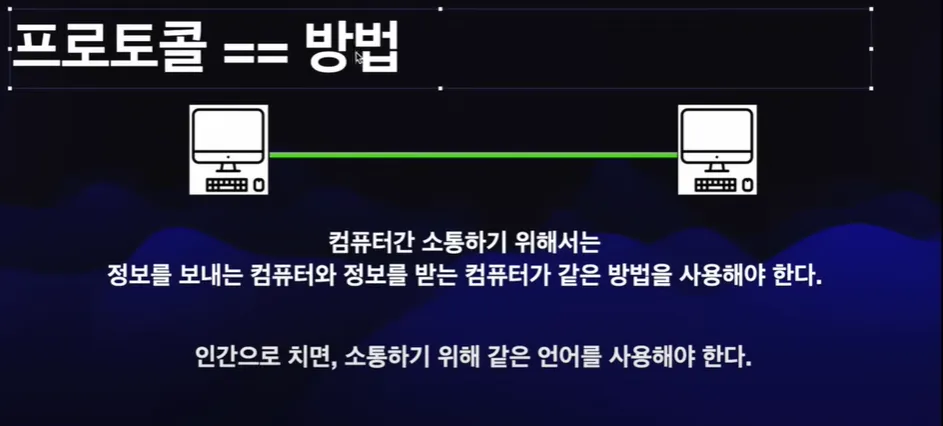

# 프로토콜이란?

프로토콜(Protocol)이란 컴퓨터 네트워크에서 서로 다른 시스템들이 데이터를 주고받기 위해 사용하는 규칙과 약속의 집합을 의미한다. 프로토콜은 통신하는 장치들 간의 일관된 데이터 교환을 가능하게 하며, 이 규칙에 따라 데이터가 어떻게 형식화되고, 어떻게 전송되며, 오류가 발생했을 때 어떻게 처리되는지를 정의한다.

## 프로토콜의 역할

1. **데이터 형식화**: 데이터를 전송하기 전에 어떻게 구조화하고, 어떤 형식으로 만들어야 하는지 결정한다. 예를 들어, 웹에서 HTML 페이지를 전달할 때는 HTTP 프로토콜을 사용한다.

2. **데이터 전송**: 데이터를 네트워크를 통해 어떻게 전송할지 정의한다. 데이터가 어떻게 패킷으로 나뉘고, 전송된 패킷이 어떻게 다시 조립될지를 규정한다.

3. **에러 처리**: 데이터 전송 중 발생할 수 있는 오류를 어떻게 감지하고, 어떻게 복구할지에 대한 규칙을 정한다.

4. **연결 관리**: 장치 간의 연결 설정, 유지, 종료를 위한 절차를 규정한다. 예를 들어, TCP 프로토콜은 연결 지향적 프로토콜로, 신뢰성 있는 연결을 설정하고 관리한다.

## 인터넷에서 사용되는 프로토콜의 종류

- TCP: 앞서 설명한 것처럼 TCP는 안정적인 데이터 전달을 보장하는 전송 계층 프로토콜이다. TCP는 IP와 함께 사용하기위한 것이며 두 프로토콜은 종종 TCP/IP로 함께 참조된다.

- HTTP: 하이퍼텍스트 전송 프로토콜(HTTP)은 대부분의 사용자가 상호 작용하는 인터넷인 월드와이드웹의 기초이다. 장치간에 데이터를 전송하는 데 사용된다. HTTP는 애플리케이션(예: 브라우저)이 추가 해석 없이 직접 사용할 수 있는 형식으로 데이터를 저장하므로 애플리케이션 계층(계층 7)에 해당합니다. OSI 모델의 하위 계층은 애플리케이션이 아닌 컴퓨터의 운영 체제에서 처리된다.

HTTPS: HTTP의 문제점은 암호화되지 않아서 HTTP 메시지를 가로채면 모든 공격자가 읽을 수 있다. HTTPS(HTTP Secure)는 HTTP 메시지를 암호화하여 이 문제를 해결한다.

TLS/SSL: 전송 계층 보안(TLS)은 HTTPS에서 암호화에 사용하는 프로토콜이다. TLS는 이전에는 보안 소켓 계층(SSL)이라고 불린다.

UDP: UDP(사용자 데이터그램 프로토콜)는 전송 계층에서 TCP보다는 더 빠르지만 안정성이 떨어진다. UDP는 빠른 데이터 전달이 가장 중요한 비디오 스트리밍 및 게임과 같은 서비스에서 자주 사용된다.

### TCP와 UDP

#### TCP의 신뢰성

 TCP(Transmission Control Protocol)는 전송된 각 패킷이 목적지에 안전하게 도달하는지 확인하는 신뢰성 보장 메커니즘을 갖추고 있다. 이는 다음과 같은 절차를 통해 이루어진다:

- 패킷 확인(Acknowledgement): 각 패킷이 목적지에 도착하면, 수신자는 해당 패킷의 수신을 보낸 측에 확인(ACK) 신호를 보낸다.
- 재전송: 만약 일정 시간 내에 ACK 신호가 수신되지 않으면, TCP는 해당 패킷이 손실된 것으로 간주하고 재전송한다.
- 패킷 순서 제어: TCP는 패킷이 올바른 순서로 재조립되도록 순서 번호(Sequence Number)를 각 패킷에 부여하며, 수신 측에서 순서를 기준으로 패킷을 정렬하고 손실된 패킷이 있다면 재전송을 요청한다.
이러한 신뢰성 있는 전송 방식 때문에 TCP는 연결 지향적 프로토콜이라 불리며, 안정적인 통신을 위해 시간과 리소스를 더 많이 사용한다.

#### UDP의 신뢰성

반면 UDP(User Datagram Protocol)는 패킷을 보낸 후 수신 확인 없이 그대로 전송을 종료하는 방식이다. UDP는 다음과 같은 특징을 가진다:

- 수신 확인 없음: UDP는 패킷이 제대로 도착했는지 확인하는 과정이 없다. ACK 신호를 보내지 않으므로 전송된 패킷의 성공 여부를 보장하지 않는다.
- 재전송 없음: 손실된 패킷을 다시 전송하지 않는다. 수신자가 데이터의 일부를 놓치면, 그 정보는 복구되지 않는다.
- 순서 보장 없음: UDP는 패킷에 순서 번호를 붙이지 않으므로, 수신자가 패킷을 받은 순서 그대로 처리해야 하며, 순서가 어긋나더라도 수정이 불가능하다.
UDP는 연결 설정 및 확인 절차가 없기에 전송 속도가 빠르고, 패킷 손실에 민감하지 않은 스트리밍, 게임 등에 적합하다.

### 데이터의 단위

- 스트림(Stream)

연속된 데이터 흐름을 의미하며, 일반적으로 TCP 같은 연결 지향 프로토콜에서 사용된다.
데이터가 연속적으로 전송되기 때문에, 전송 순서와 데이터 무결성이 보장된다.
예를 들어, 동영상 스트리밍이나 오디오 스트리밍 같은 실시간 전송에서는 스트림이 사용된다.

- 세그먼트(Segment):

전송 계층(OSI 4계층)에서 사용되는 데이터 단위로, 주로 TCP 프로토콜에서 세그먼트라 불린다.
스트림 데이터를 일정 크기로 나누어 송신 측에서 세그먼트로 캡슐화한 후 수신 측에서 순서대로 재조립한다.
TCP 헤더에는 순서 번호와 오류 검사 필드가 포함되어 있어 데이터의 순서와 무결성을 유지할 수 있다.

- 패킷(Packet):

네트워크 계층(OSI 3계층)에서 사용되는 데이터 단위로, IP 프로토콜에서 패킷이라 불린다.
각 패킷에는 출발지와 목적지 IP 주소가 포함되어 있어 패킷이 올바른 목적지에 도달할 수 있도록 라우팅된다.
세그먼트가 네트워크 계층에 전달되면 IP 헤더가 추가되어 패킷으로 캡슐화된다.

- 프레임(Frame):

데이터 링크 계층(OSI 2계층)에서 사용하는 데이터 단위로, 물리적인 네트워크 인터페이스 간 전송에 사용된다.
프레임은 MAC 주소와 같은 링크 계층 주소를 포함하며, 물리 계층에서 전달될 준비가 된 상태다.
패킷이 데이터 링크 계층으로 내려가면서 프레임으로 캡슐화되며, 비트 단위로 변환되어 실제 전송이 이루어진다.

# 인터페이스

> 컴퓨터 시스템이나 프로그램 간의 상호작용 방법이나 매개체로, 장치 간, 프로그램 간 또는 사용자와 프로그램 간에 데이터를 주고받을 수 있도록 연결하는 방식이나 규칙을 말한다. 인터페이스는 데이터를 전송하는 방법뿐 아니라, 장치가 어떻게 연결되는지 또는 어떤 기능을 수행할 수 있는지 등도 정의한다.

## 프로토콜과 인터페이스의 차이

웹에서 브라우저가 서버와 소통할 때 HTTP는 프로토콜로서, 데이터 요청과 응답의 형식, 상태 코드 등을 정의한다. 반면, 이 과정에서 서버가 웹 API라는 인터페이스를 통해 데이터 조회나 저장 기능을 제공하면, 브라우저는 API 인터페이스를 사용해 HTTP 프로토콜을 통해 서버와 상호작용하게 된다.

따라서 프로토콜과 인터페이스는 상호 보완적이며, 서로 다른 시스템이 소통하기 위한 규칙과 방법이라는 점에서 공통점이 있다.