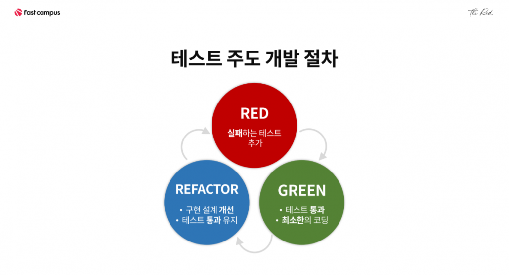

# TDD란?

테스트 주도 개발(test-driven development, TDD)은 소프트웨어 개발 방법론 중의 하나로, 선 개발 후 테스트 방식이 아닌 선 테스트 후 개발 방식의 프로그래밍 방법을 말한다. 다시 말해 먼저 자동화된 테스트 코드를 작성한 후 테스트를 통과하기 위한 코드를 개발하는 방식의 개발 방식을 말한다.



# TDD를 이용한 개발 방법

1. 테스트 케이스 작성(RED 단계)

    만들고 싶은 기능을 점검할 테스트 코드를 작성한다. 이때, 아직 기능 코드를 구현하지 않았으므로 테스트 결과는 실패로 반환된다. 실패하는 테스트를 가장 빠르게 구현하는 방법은 아무 값이나 반환하도록 하는 것이다.

    ```javascript
        function add(a, b) {
            // 아직 구현되지 않음
        }

        function subtract(a, b) {
            // 아직 구현되지 않음
        }
        // calculator.test.js (Jest)
        describe("Calculator", () => {
            test("should add two numbers", () => {
                expect(add(1, 2)).toBe(3); // 실패
            });

            test("should subtract two numbers", () => {
                expect(subtract(5, 2)).toBe(3); // 실패
            });
        });
    ```


2. 테스트 케이스를 통과하는 코드 작성(Green단계)

    테스트 코드를 만족시킬 수 있는 **기능을 구현**한다. 테스트 통과를 최우선으로 생각하며 작업한다. 즉 단위 테스트를 통과할 수 있을 정도의 최소한의 코드만 작성한다.
     ```javascript
    // calculator.js
        function add(a, b) {
            return a + b; // 구현 완료
        }

        function subtract(a, b) {
            return a - b; // 구현 완료
        }
        // calculator.test.js (Jest)
        describe("Calculator", () => {
            test("should add two numbers", () => {
                expect(add(1, 2)).toBe(3); // 성공
            });

            test("should subtract two numbers", () => {
                expect(subtract(5, 2)).toBe(3); // 성공
            });
        });
    ```

3. 작성한 코드 리팩토링(Refactor 단계)

    기능의 성능이 향상되며, 재사용성이 좋고, 가독성이 좋은 코드로 기능 코드를 개선한다. 테스트 코드를 통해 다시 기능 코드를 점검한다. → 기능 테스트가 완전해질 때까지 2, 3의 과정을 반복한다. (충분한 상태라면 스킵한다.)
    
    ```javascript
        // 리팩토링이 필요 없는 코드라 skip
        function add(a, b) {
        return a + b; // 덧셈 구현
        }

        function subtract(a, b) {
            return a - b; // 뺄셈 구현
        }

        // calculator.test.js (Jest)
        describe("Calculator", () => {
            test("should add two numbers", () => {
                expect(add(1, 2)).toBe(3); // 테스트 통과
            });

            test("should subtract two numbers", () => {
                expect(subtract(5, 2)).toBe(3); // 테스트 통과
            });
        });
    ```

이 세 단계를 요약하면, 먼저 테스트 케이스와 테스트 코드를 작성한다. 테스트 코드가 개발을 주도하기 위해서는 반드시 실패를 포함하는 테스트 코드의 작성이 앞서야 한다. 다음으로는 테스트 케이스를 통과하는 코드를 작성한다. 작성된 코드는 개선될 수 있는 많은 여지를 포함한 코드이다. 마지막으로 리팩토링 단계에서 이를 개선한다.

# TDD의 장점

### 객체 지향적인 코드 개발
TDD는 코드의 재사용 보장을 명시하므로 TDD를 통한 소프트웨어 개발 시 기능별로 모듈화가 이루어진다. 이는 의존성과 종속성이 낮은 모듈로 조합된 소프트웨어 개발을 가능하게 하며, 필요에 따라 모듈을 추가하거나 제거해도 소프트웨어 전체 구조에 영향을 미치지 않게 된다.

### 설계 수정시간의 단축
테스트코드를 먼저 작성하기 때문에 최초 설계안을 만족하게 하며 입출력 구조와 기능의 정의를 명확하게 하게 되므로 설계의 구조적 문제를 바로 찾아낼 수 있다.

### 유지보수(리팩토링)의 용이성
기본적으로 단위 테스트 기반의 테스트 코드를 작성하기 때문에 추후 문제가 발생하였을 때 각각의 모듈별로 테스트를 진행해보면 문제의 지점을 쉽게 찾을 수 있다.

### 테스트 문서의 대체 가능
대부분의 개발 프로젝트에서 테스트를 진행하는 경우 단순 통합 테스트에 지나지 않는다. TDD를 하게 될 때 테스팅을 자동화시킴과 동시에 더욱 정확한 테스트 근거를 산출해 정의서를 작성할 수 있다.

# TDD의 단점

### 생산성 저하
프로젝트를 진행할 때 경험 때문에 어떤 예외상황이 발생할지 눈에 뻔히 보이는 경우가 종종 있다. 이러한 단발성 개발은 개발 기간이 타이트하게 잡히는 경우가 많은데, 이럴 때 TDD를 이용해 테스트 코드를 작성하고 그에 통과하기 위한 코드를 작성한다면 비효율적일 것이다.

### 사전준비 기간
TDD를 프로젝트에 도입하려면 사전에 필요한 지식을 습득하고 개발 환경을 구축해야 한다. TDD를 효과적으로 사용할 수 있는 수준으로 개발자를 교육하는 시간이 필요하다.

> 사전 준비 기간이 필요한 이유?
<br>1. 개발 문화 - 기존의 습관이 있어서 변하기 어려우며, 팀의 합의가 필요하다.
<br>2. 기존 코드와의 통합 - 레거시 코드에 TDD를 적용시키기 위해선 리팩토링이 필요하다. 특히, 복잡한 비즈니스 로직이 있는 경우 테스트 커버리지를 확보하기 어렵다.
<br>3. 기술적 장벽 - TDD에 사용되는 도구의 이해도가 낮다면 적절한 테스트가 어렵다.
<br>4. 시간과 비용 - 익숙해 질 때 까지 생상성이 떨어지기 때문에 단기적인 성과를 우선시 한다면 도입이 어렵다.
<br>5. 개발 프로세스 변경 - TDD는 개발 프로세스의 흐름을 바꾸며, 개발자들은 요구 사항을 이해하고 이를 테스트 케이스로 변환하는 것이 익숙하지 않으면 어려움을 겪을 수 있습니다.