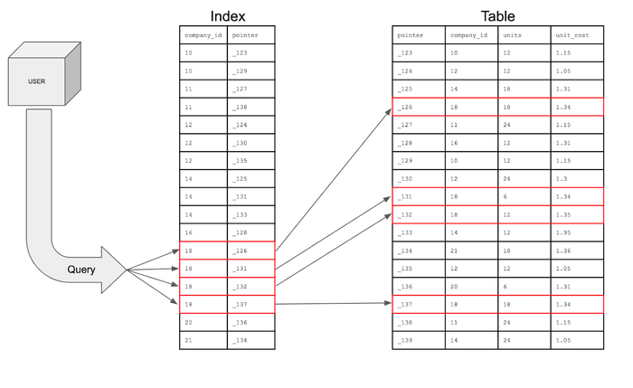

# Index

> 인덱스란 추가적인 쓰기 작업과 저장 공간을 활용하여 데이터베이스 테이블의 검색 속도를 향상시키기 위한 자료구조이다. 만약 우리가 책에서 원하는 내용을 찾는다고 하면, 책의 모든 페이지를 찾아 보는것은 오랜 시간이 걸린다. 그렇기 때문에 책의 저자들은 책의 맨 앞 또는 맨 뒤에 색인을 추가하는데, 데이터베이스의 index는 책의 색인과 같다. 

> 인덱스를 활용하면, 데이터를 조회하는 SELECT 외에도 UPDATE나 DELETE의 성능이 함께 향상된다. 그러한 이유는 해당 연산을 수행하려면 해당 대상을 조회해야만 작업을 할 수 있기 때문이다.

> 만약 index를 사용하지 않은 컬럼을 조회해야 하는 상황이라면 전체를 탐색하는 Full Scan을 수행해야 한다. Full Scan은 전체를 비교하여 탐색하기 때문에 처리 속도가 떨어진다.

## Index는 언제 사용되는거임?

### 사용되는 상황
- 인덱스 컬럼 조회: 쿼리에서 인덱스가 걸린 컬럼이 SELECT 문에 포함되거나 WHERE, ORDER BY, GROUP BY 절에 사용되면, 데이터베이스는 인덱스를 참조하여 데이터를 더 빠르게 찾는다.

- 예를 들어, SELECT name FROM users WHERE user_id = 100 쿼리에서 user_id 컬럼에 인덱스가 걸려 있다면, 데이터베이스는 user_id를 기준으로 인덱스를 검색하고, 해당 값이 있는 위치로 바로 접근할 수 있다.

### 인덱스가 사용되지 않는 경우
- 인덱스 컬럼이 포함되지 않은 경우: 예를 들어, SELECT name FROM users와 같이 인덱스 컬럼이 조회되지 않으면 인덱스가 사용되지 않는다.(index가 memberNo에 걸려있을 경우)
- 비효율적인 조건: LIKE '%값%'와 같이 인덱스의 특성을 활용할 수 없는 조건에서도 인덱스가 사용되지 않을 수 있다.
- 결론적으로, 인덱스가 걸린 컬럼이 쿼리에서 사용될 때 인덱스가 활성화되어 검색 성능을 향상시킨다.

## 그럼 index를 다 만들면 편한거아님?

> DBMS는 index를 항상 최신의 정렬된 상태로 유지해야 원하는 값을 빠르게 탐색할 수 있다. 그렇기 때문에 인덱스가 적용된 컬럼에 INSERT, UPDATE, DELETE가 수행된다면 각각 다음과 같은 연산을 추가적으로 해주어야 하며 그에 따른 오버헤드가 발생한다.

 > 만약 CREATE, DELETE, UPDATE가 빈번한 속성에 인덱스를 걸게 되면 인덱스의 크기가 비대해져서 성능이 오히려 저하되는 역효과가 발생할 수 있다. 그러한 이유 중 하나는 DELETE와 UPDATE 연산 때문이다. 앞에서 설명한대로, UPDATE와 DELETE는 기존의 인덱스를 삭제하지 않고 '사용하지 않음' 처리를 해준다고 하였다. 만약 어떤 테이블에 UPDATE와 DELETE가 빈번하게 발생된다면 실제 데이터는 10만건이지만 인덱스는 훨씬 많이 존재하게 되어, SQL문 처리 시 비대해진 인덱스에 의해 오히려 성능이 떨어지게 될 것이다. 
 

- INSERT: 새로운 데이터에 대한 인덱스를 추가함
- DELETE: 삭제하는 데이터의 인덱스를 사용하지 않는다는 작업을 진행함
- UPDATE: 기존의 인덱스를 사용하지 않음 처리하고, 갱신된 데이터에 대해 인덱스를 추가함

##  인덱스(index)의 장점과 단점 

### 장점

- 테이블을 조회하는 속도와 그에 따른 성능을 향상시킬 수 있다.
- 전반적인 시스템의 부하를 줄일 수 있다.

### 단점

- 인덱스를 관리하기 위해 해당 테이블의 약 10%에 해당하는 저장공간이 필요하다.
- 인덱스를 관리하기 위해 추가 작업이 필요하다.
- 인덱스를 잘못 사용할 경우 오히려 성능이 저하되는 역효과가 발생할 수 있다.

### 인덱스(index)를 사용하면 좋은 경우

- 규모가 작지 않은 테이블
- INSERT, UPDATE, DELETE가 자주 발생하지 않는 컬럼
- JOIN이나 WHERE 또는 ORDER BY에 자주 사용되는 컬럼
- 데이터의 중복도가 낮은 컬럼

> 중복도가 높은 컬럼에 인덱스를 걸면 인덱스 검색 결과가 많아져서 정확히 원하는 데이터를 찾는 데 시간이 더 걸리기 때문이다. 

> 인덱스를 사용하는 것 만큼이나 생성된 인덱스를 관리해주는 것도 중요하다. 그러므로 사용되지 않는 인덱스는 바로 제거를 해주어야 한다. 

## 인덱스의 자료구조

### 해시 테이블 (Hash Table)
> 해시 테이블은 데이터를 키-값(Key-Value) 쌍으로 저장하는 구조이다. 검색하려는 데이터의 키를 사용해 데이터 위치를 찾는 방식으로, 검색 속도가 매우 빠르다. 예를 들어 전화번호부에서 "홍길동"이라는 이름으로 그 사람의 전화번호를 찾는 것과 비슷하다.

> 시간복잡도 $O(1)$

- 장점: 등호 = 연산이 빠르며, 검색에 시간이 거의 걸리지 않는다.
- 단점: > 또는 < 같은 부등호 조건으로 검색할 때는 작동하지 않는다. 예를 들어, "이름이 '나'로 시작하는 모든 사람"을 찾는 검색에는 적합하지 않다. 해시 테이블은 '완전히 같은 값'을 찾는 데 특화되었기 때문에 범위 검색에는 적합하지 않다.
이런 이유로 데이터베이스의 일반적인 인덱스 구조로는 잘 사용되지 않는다.

### B+Tree
> B+Tree는 데이터를 트리 구조로 저장하는 방식으로, 순차적인 범위 검색이 필요한 경우에 적합하다. B+Tree는 아래와 같은 특성을 가지고 있다.

> 시간복잡도 $O(\log_2n)$

- 모든 데이터는 리프(leaf) 노드에만 저장하고, 리프 노드가 연결 리스트로 이어져 있어 순차적인 탐색이 가능하다.
- 루트와 중간 노드에는 데이터가 아닌 **키(Key)**만 저장되며, 이를 통해 빠르게 리프 노드에 접근할 수 있다.
- 예를 들어, 게시판에서 작성일 기준으로 게시글을 정렬해 검색하는 경우 B+Tree가 효과적이다. 작성일이 순서대로 연결되어 있어 원하는 날짜에 해당하는 게시글들을 빠르게 찾을 수 있다.

- 장점: 부등호 검색(범위 검색)이 가능하며 데이터 정렬이 용이하다. 예를 들어, 날짜 > 2024-01-01과 같은 조건 검색을 빠르게 처리할 수 있다.
- 단점: 해시 테이블보다는 속도가 약간 느리며, 데이터를 삽입하고 삭제할 때 구조가 조정되므로 시간이 더 걸릴 수 있다.
- B+Tree는 이런 특성 덕분에 데이터베이스 인덱스에서 가장 흔히 사용되는 구조다.

### Recap

> 즉 해시 테이블은 "딱 맞는 값만" 빠르게 찾는 용도로, 정렬 개념이 없어 범위 검색이 불가하다.
B+ 트리는 데이터가 순서대로 정렬되어 있어 "범위 검색"을 할 수 있다.