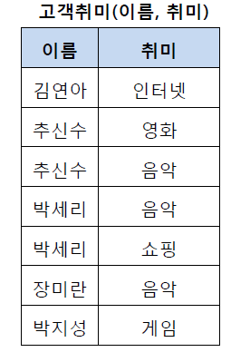
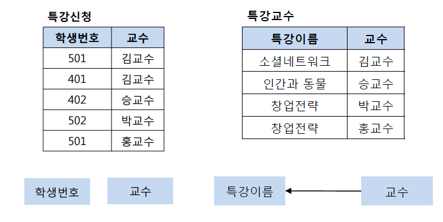

# 데이터 정규화

> 정규화(Normalization)의 기본 목표는 테이블 간에 중복된 데이타를 허용하지 않는다는 것이다. 중복된 데이터를 허용하지 않음으로써 무결성(Integrity)를 유지할 수 있으며, DB의 저장 용량 역시 줄일 수 있다. 
이러한 테이블을 분해하는 정규화 단계가 정의되어 있으며, 여기서 테이블을 어떻게 분해되는지에 따라 정규화 단계가 달라진다.

## 정규화의 장점과 단점

### 장점

- 데이터 중복 제거: 동일한 데이터가 여러 곳에 저장되는 것을 방지하여 저장 공간을 절약한다.
- 데이터 무결성 향상: 데이터 변경 시 일관성을 유지할 수 있어 무결성이 높아진다.
- 유지 보수 용이: 구조가 잘 정리되어 있어 데이터베이스를 관리하고 수정하는 데 용이하다.

### 단점

- 성능 저하: 지나치게 정규화할 경우, JOIN 연산이 증가하여 쿼리 성능이 저하될 수 있다.
- 복잡한 쿼리: 여러 테이블 간의 관계를 복잡하게 만들어 쿼리가 어려워질 수 있다.

## 제 1 정규화(1NF, First Normal Form)

> 모든 필드의 값이 원자적(Atomic)이어야 하며, 각 행이 고유해야 한다.

- 위의 테이블에서 추신수와 박세리는 여러 개의 취미를 가지고 있기 때문에 제1 정규형을 만족하지 못하고 있다. 그렇기 때문에 이를 제1 정규화하여 분해할 수 있다. 제1 정규화를 진행한 테이블은 아래와 같다.

## 제 2 정규화(2NF, Second Normal Form)

> 1NF를 만족하고, 기본 키가 아닌 모든 필드가 기본 키에 완전 함수 종속(Full Functional Dependency)해야 한다.

- 이 테이블에서 기본키는 (학생번호, 강좌이름)으로 복합키이다. 그리고 (학생번호, 강좌이름)인 기본키는 성적을 결정하고 있다. (학생번호, 강좌이름) -> (성적) 그런데 여기서 강의실이라는 컬럼은 기본키의 부분집합인 강좌이름에 의해 결정될 수 있다. (강좌이름) -> (강의실)즉, 기본키(학생번호, 강좌이름)의 부분키인 강좌이름이 결정자이기 때문에 위의 테이블의 경우 다음과 같이 기존의 테이블에서 강의실을 분해하여 별도의 테이블로 관리하여 제2 정규형을 만족시킬 수 있다.

## 제 3 정규화(3NF, Third Normal Form)

> 2NF를 만족하고, 기본 키가 아닌 모든 필드가 기본 키에 이행적 종속(Transitive Dependency)되지 않아야 한다.

- 기존의 테이블에서 학생 번호는 강좌 이름을 결정하고 있고, 강좌 이름은 수강료를 결정하고 있다. 그렇기 때문에 이를 (학생 번호, 강좌 이름) 테이블과 (강좌 이름, 수강료) 테이블로 분해해야 한다. 
이행적 종속을 제거하는 이유는 비교적 간단하다 
 예를 들어 501번 학생이 수강하는 강좌가 스포츠경영학으로 변경되었다고 하자.   
이행적 종속이 존재한다면 501번의 학생은 스포츠경영학이라는 수업을 20000원이라는 수강료로 듣게 된다. 물론 강좌 이름에 맞게 수강료를 다시 변경할 수 있지만 이러한 번거로움을 해결하기 위해 제3 정규화를 하는 것이다.  즉, 학생 번호를 통해 강좌 이름을 참조하고, 강좌 이름으로 수강료를 참조하도록 테이블을 분해해야 하며 그 결과는 다음의 그림과 같다.

## BCNF 정규화
> BCNF 정규화란 제3 정규화를 진행한 테이블에 대해 모든 결정자가 후보키가 되도록 테이블을 분해하는 것이다.

- 특강수강 테이블에서 기본키는 (학생번호, 특강이름)이다. 그리고 기본키 (학생번호, 특강이름)는 교수를 결정하고 있다. 또한 여기서 교수는 특강이름을 결정하고 있다.   그런데 문제는 교수가 특강이름을 결정하는 결정자이지만, 후보키가 아니라는 점이다. 그렇기 때문에 BCNF 정규화를 만족시키기 위해서 위의 테이블을 분해해야 하는데, 다음과 같이 특강신청 테이블과 특강교수 테이블로 분해할 수 있다.

