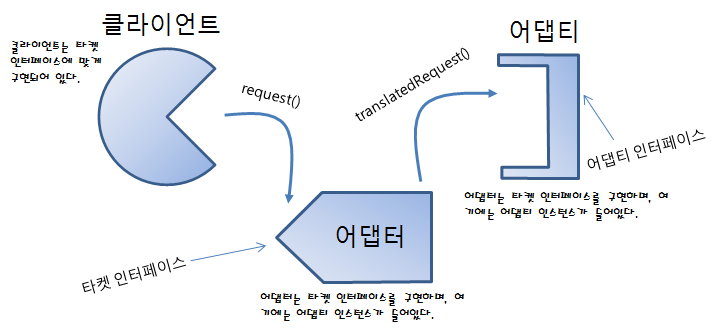

# 어답터 패턴 (Adapter Patter)

>  서로 다른 인터페이스를 가진 클래스 간의 호환성을 제공하기 위해 래퍼(Wrapper)를 만드는 패턴이다. 

> 어댑터 패턴(Adaptor Pattern) 이란 이름 그대로 클래스를 어댑터로서 사용되는 구조 패턴이다.



## 사용하는 이유

- 외부 라이브러리나 기존 코드를 새로운 시스템에 통합할 때 유용하다.
- 코드의 변경 없이도 기존 코드와 새로운 코드의 호환성을 유지할 수 있다.
- 클라이언트 코드가 변경되지 않고도 새로운 구현체를 쉽게 사용할 수 있도록 도와준다.

## 사용 예시


```java
// Adaptee : 클라이언트에서 사용하고 싶은 기존의 서비스 (하지만 호환이 안되서 바로 사용 불가능)
class Service {

    void specificMethod(int specialData) {
        System.out.println("기존 서비스 기능 호출 + " + specialData);
    }
}

// Client Interface : 클라이언트가 접근해서 사용할 고수준의 어댑터 모듈
interface Target {
    void method(int data);
}

// Adapter : Adaptee 서비스를 클라이언트에서 사용하게 할 수 있도록 호환 처리 해주는 어댑터
class Adapter implements Target {
    Service adaptee; // composition으로 Service 객체를 클래스 필드로

    // 어댑터가 인스턴스화되면 호환시킬 기존 서비스를 설정
    Adapter(Service adaptee) {
        this.adaptee = adaptee;
    }

    // 어댑터의 메소드가 호출되면, Adaptee의 메소드를 호출하도록
    public void method(int data) {
        adaptee.specificMethod(data); // 위임
    }
}

class Client {
    public static void main(String[] args) {
        // 1. 어댑터 생성 (기존 서비스를 인자로 받아 호환 작업 처리)
        Target adapter = new Adapter(new Service());

        // 2. Client Interfac의 스펙에 따라 메소드를 실행하면 기존 서비스의 메소드가 실행된다.
        adapter.method(1);
    }
}
```