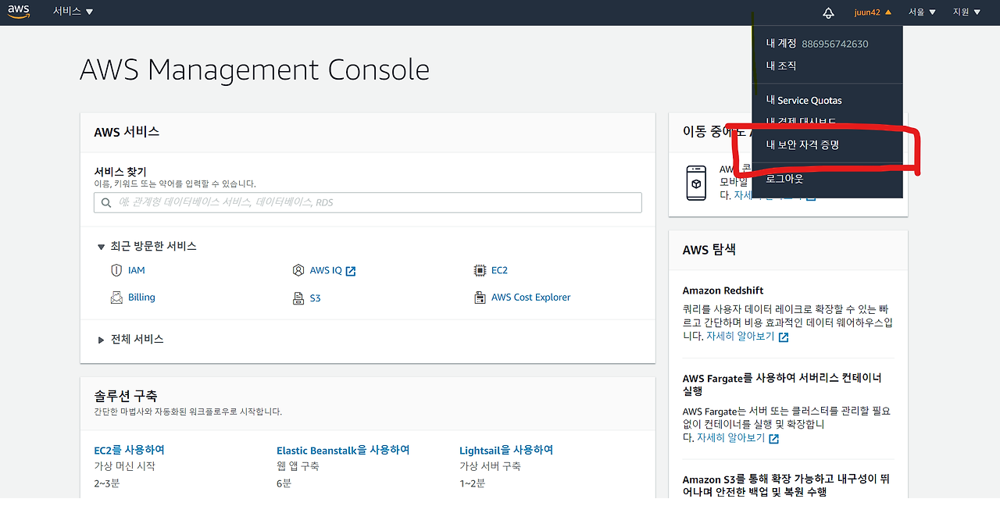

## AWS EC2 인스턴스와 연결하기
- AWS 회원 가입
- EC2 인스턴스 생성, 보안 그룹 설정에 대한 추가 설명 필요할듯
- EIP 할당(ON/OFF시 고정 IP 할당) 하는게 좋을듯
- EC2 인스턴스 완전히 삭제시키는 법?
- EC2 인스턴스와 연결하는 방법(리눅스)
- cmd를 이용해서도 해당 방법으로 가능(리눅스 권장)

```bash
$ ssh -i {YOUR_KEY_PAIR_FILE.pem} {USER_NAME}@{AWS_PUBLIC_DNS_}
```
USER_NAME은 아마존 리눅스2 나 아마존 리눅스 AMI를 쓴다면 ec2-user 로 작성하면 된다.

```bash
The authenticity of host '43.201.86.129 (43.201.86.129)' can't be established.
ED25519 key fingerprint is SHA256:so6Cq0jfa/9TSJe1DnpYNvOYD2obN+oUDHBg9UW5ZyA.
This key is not known by any other names.
Are you sure you want to continue connecting (yes/no/[fingerprint])?
```

나오면 잘 접속된 것으로, yes로 진행하면 된다

## AWS에 Docker container 빌드하기

- 예제 nodejs 설치 & 작성법
    - nodejs 18v 다운로드
    - `npm init`
    - `npm install express`
    - express 예제 코드 작성

- `Dockerfile` 생성
    - 빌드한다
    - `docker build --platform linux/amd64 -m 8g -t <IMAGE_TAG> .`
    - alpine으로 빌드시 용량 경량으로 만들 수 있음, 대신 bash 사용불가하고 라이브러리 많을 시 문제 생길 수 있음


## ECR에 빌드한 컨테이너를 push하는 방법

- 윈도우 AWS CLi 설치방법
    - cmd 를 관리자 모드로 실행
    - `msiexec.exe /i https://awscli.amazonaws.com/AWSCLIV2.msi` 입력

- .aws/credentials 파일을 찾는다.
    - window의 경우 `C:\Users\<YourUserName>\.aws\credentials` 에 있다.
    -  해당 버튼을 클릭해 액세스 키를 발급받는다.
    - cmd로 가서 `aws configure` 입력
    - 키 복사 붙여넣기
    - `ap-northeast-2` 입력 (한국)
    - `json` 입력

- aws 로그인을 해야한다. window의 경우 사용자 위치(USER)의 cmd를 사용한다
    - `aws ecr get-login-password --region ap-northeast-2` 입력
    - `aws ecr get-login-password --region ap-northeast-2 | docker login --username AWS --password-stdin <ECR_URL>` 입력 , ECR_URL에는 ECR 레포지토리 URI를 넣는다
    - `docker tag <이미지 이름>:latest <ECR_URL>/<이미지이름>:latest`
    - `docker push <ECR_URL>/<이미지 이름>:latest` AWS ECR에 push 한다.

- [ec2 인스턴스로 로그인한다](#aws-ec2-인스턴스와-연결하기)
    - docker를 설치한다.
        - `sudo yum update -y`
        - `sudo yum install -y docker`
        - `sudo systemctl start docker`
        - `sudo systemctl enable docker`
        - `sudo usermod -aG docker ec2-user`
        - 로그아웃 후 재시작
        - `docker --version` 으로 실행 확인
    - ec2 인스턴스에서 ecr에 로그인한다.
        - `aws ecr get-login-password --region ap-northeast-2 | docker login --username AWS --password-stdin <ECR_URL>`
    - 서버에서 pull 및 실행
        - `docker run -d -p 3000:3000 --name namhoon-dev 864899837208.dkr.ecr.ap-northeast-2.amazonaws.com/namhoon-dev:latest` 

- AWS ec2 인스턴스에 docker-compose 설치하기
```shell
// 최신 docker compose를 해당 링크에서 받을 수 있음
sudo curl -L https://github.com/docker/compose/releases/latest/download/docker-compose-$(uname -s)-$(uname -m) -o /usr/local/bin/docker-compose


// 권한 부여
sudo chmod +x /usr/local/bin/docker-compose


// 설치 확인
docker-compose version
```

- 80번 포트 linux에서 라우팅
```shell
# 80번 포트로 들어오는 트래픽을 7777번 포트로 라우팅
sudo iptables -t nat -A PREROUTING -p tcp --dport 80 -j REDIRECT --to-port 7777
# 확인
[ec2-user@ip-172-31-10-107 ~]$ sudo iptables -t nat -L -n -v
# 결과
Chain PREROUTING (policy ACCEPT 0 packets, 0 bytes)
 pkts bytes target     prot opt in     out     source               destination         
61283 3338K DOCKER     all  --  *      *       0.0.0.0/0            0.0.0.0/0            ADDRTYPE match dst-type LOCAL
    0     0 REDIRECT   tcp  --  eth0   *       0.0.0.0/0            0.0.0.0/0            tcp dpt:80 redir ports 8080
    0     0 REDIRECT   tcp  --  *      *       0.0.0.0/0            0.0.0.0/0            tcp dpt:80 redir ports 7777
# 80->8080 규칙 삭제
[ec2-user@ip-172-31-10-107 ~]$ sudo iptables -t nat -D PREROUTING -p tcp --dport 80 -j REDIRECT --to-port 8080 -i eth0
```