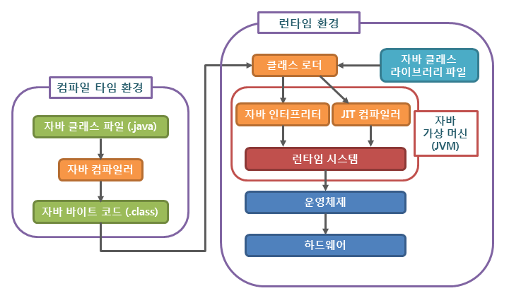
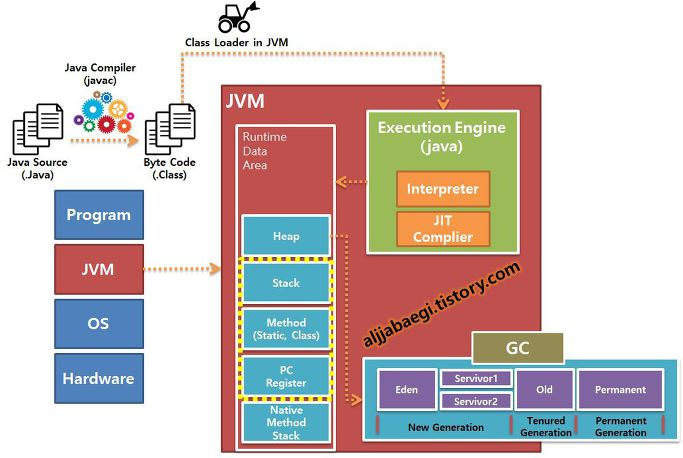

# JAVA 컴파일 과정




## 컴파일 과정

1. 소스 코드 작성: 자바 개발자는 .java 파일에 자바 소스 코드를 작성한다.

2. 컴파일 (소스 코드 → 바이트코드): **javac라는 자바 컴파일러**를 사용해 .java 파일을 바이트코드로 컴파일한다. 이 바이트코드는 .class 파일로 저장되며, 하드웨어에 맞춘 기계어가 아니라 JVM이 이해할 수 있는 중간 코드다.

3. 클래스 로딩 (Class Loading): 컴파일된 .class 파일은 **클래스 로더**에 의해 메모리로 불러들여진다. 클래스 로더는 여러 .class 파일을 로딩해 애플리케이션 실행에 필요한 모든 클래스 파일을 메모리에 적재한다.

4. 바이트코드 검증 (Bytecode Verification): JVM의 바이트코드 검증기가 바이트코드를 검사하여, 실행 가능한 코드인지 확인한다. 이 과정에서 잘못된 코드, 보안 위험이 있는 코드가 있는지 검증하고, 안전하게 실행될 수 있도록 한다.

5. 런타임 중 Just-In-Time (JIT) 컴파일: 바이트코드는 JVM의 인터프리터를 통해 한 줄씩 실행되지만, 자주 사용되는 코드나 성능이 중요한 부분은 JIT 컴파일러에 의해 기계어로 변환된다. JIT 컴파일러는 이 바이트코드를 네이티브 코드로 변환하고, 이후 이 네이티브 코드를 캐시하여 재사용한다. 이를 통해 실행 속도를 높일 수 있다.

6. 실행 (Execution): JVM이 인터프리터와 JIT 컴파일러를 통해 기계어로 변환한 코드를 실행한다. 이렇게 함으로써 자바 프로그램은 하드웨어에 종속되지 않고, 플랫폼 독립적으로 실행된다.

## JIT(Just-In-Time)과 인터프리터

### JIT와 인터프리터는 병렬로 작동하는가?

JIT 컴파일러는 인터프리터와 병렬로 작동하지 않고, 인터프리터가 코드 실행 중 필요한 부분만을 JIT로 넘기는 방식으로 작동한다. 자바 프로그램이 JVM 위에서 실행될 때 초기에는 인터프리터가 바이트코드를 한 줄씩 해석하여 실행하고, JIT 컴파일러는 이후 성능 최적화를 위해 선택된 코드 부분을 네이티브 코드로 컴파일한다. JIT는 이렇게 인터프리터와 협력하며 필요한 부분만 컴파일해 실행 성능을 높인다.

### 어떻게 중요한 부분을 판별함?

JVM은 Hotspot 방식을 사용해 JIT 컴파일러가 처리할 코드를 결정한다. Hotspot 방식에서는 자주 실행되는 코드(Hot Code)를 발견하고, 그 부분을 네이티브 코드로 변환해 성능을 최적화한다. 

1. 코드 프로파일링: 인터프리터는 초기 실행 시 바이트코드를 한 줄씩 해석하며 특정 메서드나 루프의 실행 빈도를 프로파일링한다.
2. 핫 코드 감지: 일정 횟수 이상 반복 실행된 코드가 있다면, JVM은 해당 코드를 핫 코드(Hot Code)로 간주한다.
3. JIT 컴파일로 전환: 핫 코드로 판단된 부분은 JIT 컴파일러에 의해 네이티브 코드로 컴파일된다. 이후에는 네이티브 코드를 캐시에 저장해, 인터프리터 대신 JIT 컴파일된 네이티브 코드가 사용된다.

### Hotspot의 유지기간은?

- JIT 컴파일러는 한 번 컴파일한 코드(네이티브 코드)를 캐시에 저장하고, 이후로는 해당 코드를 재사용한다. 즉, 특정 코드가 JIT 컴파일된 후에는 JVM이 인터프리터로 다시 해석하지 않고, 캐시된 네이티브 코드를 바로 실행한다.

- 자바 프로그램에서 코드가 변경되면, 핫스팟으로 판단된 부분은 그대로 유지되고, 변경된 부분만 다시 컴파일된다. 

### JIT 과 인터프리터의 성능은?

- 인터프리터: 바이트코드를 한 줄씩 해석하여 실행하기 때문에, 실행 속도가 느리다. 특히, 반복적으로 호출되는 코드에 대해서는 매번 해석해야 하므로 성능 저하가 발생할 수 있다.

- JIT 컴파일러: 바이트코드를 네이티브 코드로 변환하고, 자주 호출되는 부분을 최적화하여 실행 속도를 높인다. 이로 인해 초기 실행은 인터프리터보다 느릴 수 있지만, 이후 실행에서는 훨씬 더 빠르게 동작한다.

- JIT은 바이트코드를 직접 해석하는 대신, 이를 네이티브 코드로 컴파일하여 CPU에서 직접 실행한다. 네이티브 코드는 하드웨어에 최적화되어 있어 실행 속도가 빠르다

> 네이티브 코드(Native Code)는 특정 하드웨어 및 운영체제에서 직접 실행할 수 있는 기계어 코드 또는 바이너리 코드다. 즉, 네이티브 코드는 CPU가 이해하고 실행할 수 있는 형태로, 특정 플랫폼에 종속되어 있다.

> C/C++로 작성된 프로그램은 컴파일 시 네이티브 코드로 변환된다. 이 코드는 해당 시스템의 CPU 아키텍처와 운영체제에 맞춰져 있어, 해당 환경에서 직접 실행될 수 있다.

- JIT은 한 번 컴파일한 네이티브 코드는 캐시에 저장되어, 이후 같은 메서드 호출 시 재사용된다. 이를 통해 반복적으로 발생하는 컴파일 오버헤드를 줄일 수 있다.

## 컴파일 타임 환경이란?

> 컴파일 타임은 코드가 컴파일러에 의해 바이트코드나 기계어로 변환될 때의 환경을 말한다. 이 단계에서 변수나 메서드의 타입 검사, 문법 오류 등을 확인한다.

> 이클립스에서 빨간색 밑줄이 나타나는 것은 컴파일 타임 에러로, 컴파일 환경에서 발생한 문법 오류나 타입 불일치 등을 알려준다. 이클립스는 일반적으로 코드를 저장할 때마다 자동으로 빌드를 수행하며, 이를 통해 컴파일 에러를 즉시 확인할 수 있다.<br> 이클립스의 자동 빌드 기능은 기본적으로 활성화되어 있어, 코드가 변경되면 즉시 컴파일 과정을 거친다. 그래서 별도의 수동 컴파일 없이 코드에 에러가 있으면 빨간 밑줄이 표시된다.

자동 빌드 주기는 사용자가 직접 수정할 수 없지만, 저장(Save) 시 즉각적으로 컴파일이 이루어지도록 설정되어 있다. 이를 통해 저장한 후 바로 컴파일 에러를 확인할 수 있게 해 준다.

```java

public class CompileTimeExample {
    public static void main(String[] args) {
        int number = "hello"; // 컴파일 타임 에러: 문자열을 int에 할당할 수 없음
    }
}

```

## 런타임 환경이란?

> 런타임은 프로그램이 실제 실행될 때의 환경을 말한다. 이 단계에서는 코드가 이미 바이트코드 또는 기계어로 컴파일되어 JVM이나 운영체제 위에서 실행된다. 런타임에는 변수의 값, 메모리 상태, 입출력 동작 등이 결정된다.

```java

public class RuntimeExample {
    public static void main(String[] args) {
        int[] numbers = {1, 2, 3};
        System.out.println(numbers[5]); // 런타임 에러: 배열 인덱스 초과
    }
}

```