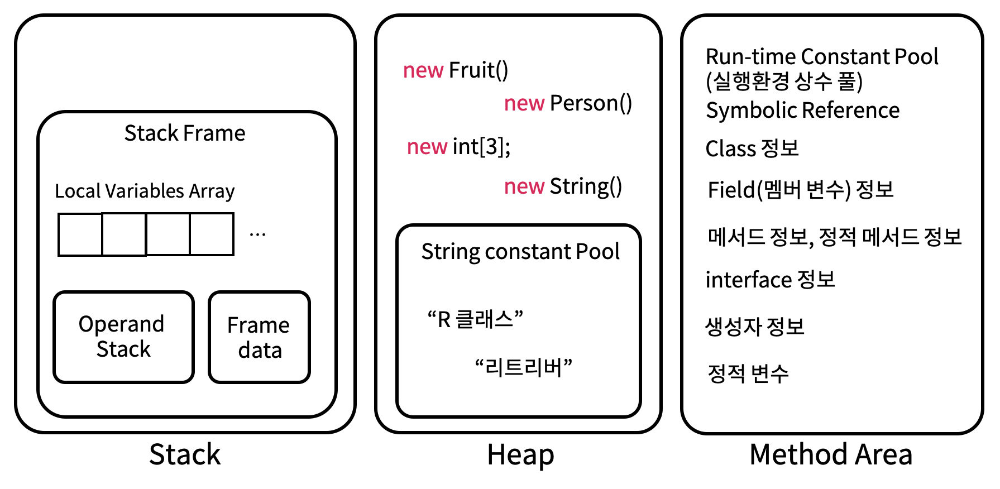

# JAVA의 메모리구조

> Java의 메모리 구조는 크게 Heap, Stack, Method Area, PC Register, Native Method Stack으로 나눌 수 있다.

## 각 영역의 특징

1. Heap

설명: 객체와 배열이 저장되는 메모리 공간이다. 
특징: 런타임에 동적으로 메모리를 할당하고 해제할 수 있다.
JVM이 가비지 컬렉션을 통해 사용하지 않는 메모리를 자동으로 회수한다다.
모든 객체 인스턴스는 이 영역에 저장된다.

2. Stack

설명: 메서드 호출 시 생성되는 프레임이 저장되는 공간이다. 

특징:
각 스레드마다 고유한 스택이 존재한다.
메서드의 로컬 변수, 매개변수, 리턴 주소가 저장된다.
LIFO(Last In, First Out) 구조로 작동하며, 메서드가 종료되면 관련된 프레임이 자동으로 제거된다.

3. Method Area

설명: 클래스 관련 정보가 저장되는 메모리 공간이다. 
특징: 클래스의 메타데이터(클래스의 변수, 메서드, 상수풀 등)가 포함된다.
JVM에 의해 클래스가 로드될 때 이 영역에 할당된다.
가비지 컬렉션이 발생할 수 있지만, 일반적으로 자주 발생하지는 않는다.

4. PC Register

설명: 현재 실행 중인 JVM 명령어의 주소를 저장하는 레지스터이다. 
특징: 각 스레드마다 고유한 PC 레지스터가 있다.
스레드가 실행하는 메서드의 바이트코드의 주소를 추적한다.

5. Native Method Stack

설명: Java가 아닌 언어로 작성된 네이티브 메서드의 정보를 저장하는 스택이다. 

특징: JNI(Java Native Interface)를 통해 호출된 네이티브 메서드의 정보를 저장한다.
Java 스택과 유사하게 동작하지만, Java 외부의 메서드를 호출할 때 사용된다.

## Recap

> Java의 메모리 구조는 객체, 메서드, 클래스, 실행 중인 명령어 등을 효율적으로 관리하고, 가비지 컬렉션을 통해 메모리 사용을 최적화한다. 이러한 구조는 Java의 플랫폼 독립성과 메모리 관리의 편리함을 지원한다.