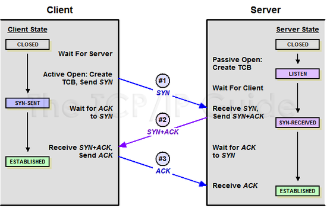

# 3way-handshake

> TCP 3 Way Handshake는 TCP/IP프로토콜을 이용해서 통신을 하는 응용프로그램이 데이터를 전송하기 전에 먼저 정확한 전송을 보장하기 위해 상대방 컴퓨터와 사전에 세션을 수립하는 과정을 의미한다.

## 과정

1. **SYN (Synchronization):** 클라이언트는 서버에게 연결 요청을 보낸다. 이 메시지에는 클라이언트가 선택한 임의의 초기 순서 번호(client_isn)가 포함된다.
2. **SYN-ACK (Synchronization-Acknowledgement):** 서버는 클라이언트의 연결 요청을 받고, 연결을 수락하는 메시지를 보낸다. 이 메시지에는 서버가 선택한 임의의 초기 순서 번호(server_isn)와 클라이언트의 초기 순서 번호에 1을 더한 값(client_isn + 1)이 포함된다.
3. **ACK (Acknowledgement):** 클라이언트는 서버의 연결 수락 메시지를 받고, 확인 응답 메시지를 보낸다. 이 메시지에는 서버의 초기 순서 번호에 1을 더한 값(server_isn + 1)이 포함된다.

## 목적

- 양방향 연결 확인: 클라이언트와 서버 모두 데이터를 송수신할 준비가 되었는지 확인한다.
- 초기 순서 번호 교환: 데이터 전송의 순서를 보장하고, 중복 패킷을 탐지하기 위해 초기 순서 번호를 교환한다.

## 장점

- 신뢰성 있는 연결 설정: 3단계의 메시지 교환을 통해 연결 설정 과정에서 발생할 수 있는 오류를 줄이고, 안정적인 통신 채널을 확보한다.
- 데이터 손실 방지: 초기 순서 번호를 교환하여 데이터 전송 순서를 보장하고, 중복 패킷을 탐지하여 데이터 손실을 방지한다.

## 단점

- 오버헤드: 연결 설정에 3개의 메시지 교환이 필요하므로, 약간의 시간 지연이 발생할 수 있다.
- SYN Flooding 공격: 악의적인 클라이언트가 다수의 SYN 메시지를 보내 서버의 자원을 고갈시키는 공격에 취약할 수 있다.

## http는 매번 handshake하면 너무 낭비아님?

> HTTP는 기본적으로 Stateless 프로토콜이다. 즉, 각 요청은 이전 요청과 독립적으로 처리되며, 서버는 클라이언트의 상태를 유지하지 않는다. 따라서 매번 새로운 TCP 연결을 설정하고 해제하는 3-way handshake 과정을 거치면 오버헤드가 발생하게 된다.

> 이러한 오버헤드를 줄이기 위해 HTTP는 지속 연결(Persistent Connection)을 사용한다. 지속 연결은 한 번 설정된 TCP 연결을 여러 HTTP 요청/응답에 재사용하는 방식이다. 이를 통해 3-way handshake 과정을 반복하지 않고도 여러 요청을 빠르게 처리할 수 있다.

## naver.com 같은 경우 http요청으로 페이지를 띄우는데 240번 이상의 http 요청이 왜 발생함?

> 웹 페이지를 띄우기 위해서는 일반적으로 여러 번의 HTTP 요청이 필요하다. 이는 웹 페이지가 구성 요소로 여러 리소스를 포함하기 때문이다.(HTML/CSS/JS/이미지/폰트/비디오 등)

1. 다양한 리소스
- HTML 문서: 기본적으로 웹 페이지를 구성하는 HTML 파일이 있다.
- CSS 파일: 스타일을 정의하는 여러 개의 CSS 파일이 있을 수 있다.
- JavaScript 파일: 동작을 제어하는 여러 개의 JavaScript 파일이 포함된다.
- 이미지 파일: 웹 페이지에 사용되는 다양한 이미지 (로고, 배경, 콘텐츠 이미지 등)가 있다.
- 비디오 및 오디오 파일: 경우에 따라 비디오 및 오디오 리소스도 포함될 수 있다.

2. 서드파티 리소스
- 광고 및 트래킹: 광고 네트워크와 트래킹 도구(예: Google Analytics 등)는 각각 별도의 요청을 발생시킨다. 이는 여러 개의 외부 스크립트 및 이미지로 이어진다.
- 소셜 미디어 통합: 페이지에 통합된 소셜 미디어 버튼(예: Facebook, Twitter 등) 또한 별도의 요청을 발생시킬 수 있다.

3. CSS와 JS의 여러 파일
- 모듈화된 CSS 및 JS: 웹사이트의 성능을 향상시키기 위해 CSS와 JavaScript 파일이 여러 개로 나누어져 있을 수 있다. 각 파일은 별도의 요청을 통해 로드된다.

4. 웹 폰트
- 폰트 파일: 웹 페이지에 사용되는 사용자 정의 폰트는 일반적으로 별도의 요청을 필요로 한다.

5. 비동기 요청
- AJAX 요청: 페이지가 로드될 때 추가적인 데이터가 필요할 경우, AJAX를 통해 비동기적으로 서버에 추가 요청을 보낼 수 있다. 이는 페이지 로드 후에도 여러 번의 요청을 발생시킬 수 있다.

6. 캐싱 및 CDN
- CDN 사용: 대형 웹사이트는 콘텐츠 배달 네트워크(CDN)를 통해 리소스를 제공하여 로딩 시간을 단축시킨다. 여러 CDN 요청이 발생할 수 있으며, 이로 인해 요청 수가 증가할 수 있다.

7. 사용자 인터페이스 요소
- 동적인 UI 요소: 다양한 UI 요소(슬라이더, 팝업 등)는 추가 리소스를 요구할 수 있다. 이러한 요소는 자바스크립트 라이브러리와 함께 사용되며, 각각 별도의 요청이 발생할 수 있다.

## 왜 한번에 안보내는거임?

> HTTP 요청은 웹 페이지의 각 리소스가 독립적으로 처리되기 때문에 한 번에 모두 보내지 않고 나눠서 보내진다. 브라우저는 HTML 문서를 로드한 후, 필요한 CSS, JavaScript, 이미지 파일 등에 대해 별도로 요청을 보내며, 이를 통해 웹 페이지를 구성하는 모든 요소를 로드하게 된다. 이 과정은 웹 페이지의 복잡성에 따라 많은 요청을 발생시킬 수 있다.

1. 리소스의 독립성 
- 웹 페이지는 HTML, CSS, JavaScript, 이미지 등 다양한 리소스로 구성된다. 각 리소스는 독립적으로 요청되고 서버로부터 응답받아야 하므로, 각 파일에 대해 별도의 HTTP 요청이 발생한다.
2. 브라우저의 요청 처리 
- 브라우저는 HTML 파일을 로드한 후, 그 안에 포함된 리소스를 파싱하고 요청을 보낸다. HTML 문서가 먼저 로드되면서 CSS 파일, JavaScript 파일, 이미지 파일 등을 찾고, 각각에 대해 별도의 요청을 보내게 된다. 이러한 방식은 웹 페이지의 구조에 따라 순차적으로 진행된다.
3. 병렬 요청 
- 현대의 웹 브라우저는 여러 개의 요청을 동시에 처리할 수 있지만, 각 요청은 여전히 독립적이다. 브라우저는 HTTP/1.1 및 HTTP/2의 규칙에 따라 동시에 여러 요청을 보내어, 각 리소스가 빠르게 로드될 수 있도록 한다.
4. 캐싱 
- 브라우저는 이미 로드된 리소스에 대해 캐시를 유지하므로, 같은 리소스를 다시 요청할 때는 서버에 요청하지 않고 캐시에서 불러올 수 있다. 이 역시 요청을 나누는 이유 중 하나다.

## 지속 연결 방식

### keep-alive

HTTP Keep-Alive는 TCP 연결을 일정 기간 동안 유지하여 여러 HTTP 요청을 동일한 연결로 처리할 수 있게 해준다. 연결의 유지 시간은 서버 설정에 따라 다르며, 일반적으로 5초에서 30초 사이로 설정된다. 

