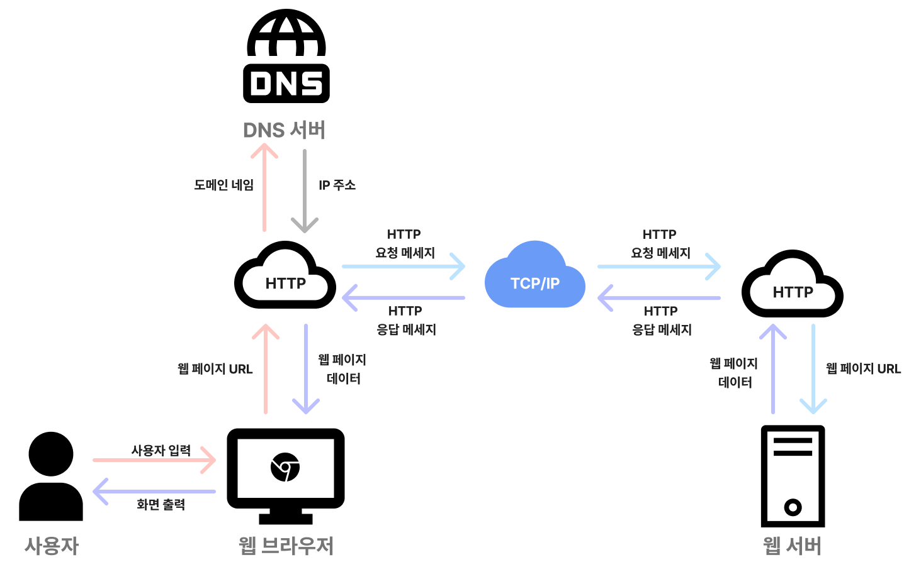

# 브라우저

> 웹 서버에서 양방향으로 통신을 하며 HTML 문서, 멀티미디어 등의 컨텐츠를 열람할 수 있게 해주는 GUI 기반의 소프트웨어 프로그램. 

> 브라우저는 페이지를 다운로드하기 위해 응용 계층의 HTTP 프로토콜을 이용해 데이터를 송신/수신한다.

## 브라우저의 동작 원리

> 브라우저는 사용자가 선택한 자원(Resource)을 서버에 요청(Request)하고, 서버로부터 받은 응답(Response)을 브라우저에 렌더링 한다(Render).

1. 사용자
브라우저를 통해 찾고 싶은 웹 페이지의 URL 주소를 입력한다.

2. DNS 서버
사용자가 입력한 URL 주소 중 도메인 네임을 검색하고,
도메인 네임에 일치하는 IP 주소를 찾아, 사용자가 입력한 URL 정보와 함께 전달한다.

3. HTTP 프로토콜
이렇게 전달 받은 IP 주소와 웹 페이지 URL 정보는 HTTP 프로토콜을 사용해 HTTP 요청 메세지를 생성한다.

4. TCP/IP 프로토콜
이 HTTP 요청 메세지는 TCP 프로토콜 사용해 인터넷을 거쳐 해당 IP 컴퓨터로 전송되고,
도착한 HTTP 요청 메세지는, HTTP 프로토콜을 이용해 웹 페이지 URL 정보로 변환한다.

5. 웹 서버
변환된 정보에 해당하는 데이터를 검색하여 찾아낸 뒤, HTTP 응답 메세지를 생성한다.
이 HTTP 응답 메세지는 다시 TCP 프로토콜을 사용해 인터넷을 거쳐 사용자의 컴퓨터로 전송되고,
도착한 HTTP 응답 메세지는, HTTP 프로토콜을 이용해 웹 페이지 데이터로 변환된다.

6. 웹 브라우저
변환된 데이터가 웹 브라우저에 출력되어 사용자가 볼 수 있게 된다.