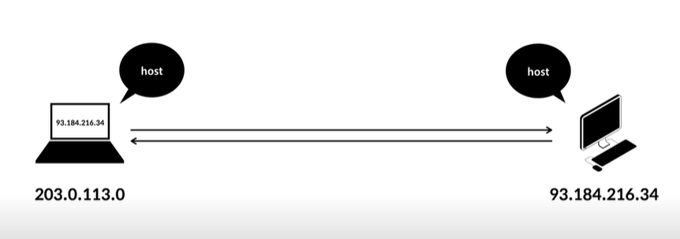

# DNS (Domain Name System)

> 참고 : 생활코딩 WEB2 - DNS https://www.youtube.com/playlist?list=PLuHgQVnccGMCI75J-rC8yZSVGZq3gYsFp

## IP주소


- 2대의 컴퓨터가 통신을 하기 위해 반드시 알아야 할 것
- 인터넷에 있는 모든 컴퓨터는 IP주소가 필수
- 각각 인터넷에 연결된 컴퓨터를 `host` 라고 칭한다
- ip와 주소를 매핑시켜 접속할 수 있게 하는 기술이 DNS이다.
- windows에선 hosts파일에 영문주소-ip 매핑을 저장해둔다.(자주 사용하는 사이트의 경우)
    - `%SystemRoot%(widnows 폴더)\System32\drivers\etc\hosts` 에 저장되어 있다.
```plaintext
# hosts 파일
# Copyright (c) 1993-2009 Microsoft Corp.
#
# This is a sample HOSTS file used by Microsoft TCP/IP for Windows.
#
# This file contains the mappings of IP addresses to host names. Each
# entry should be kept on an individual line. The IP address should
# be placed in the first column followed by the corresponding host name.
# The IP address and the host name should be separated by at least one
# space.
#
# Additionally, comments (such as these) may be inserted on individual
# lines or following the machine name denoted by a '#' symbol.
#
# For example:
#
#      102.54.94.97     rhino.acme.com          # source server
#       38.25.63.10     x.acme.com              # x client host

# localhost name resolution is handled within DNS itself.
#	127.0.0.1       localhost
#	::1             localhost

127.0.0.1    myhome.com
```
- 파일에 myhome.com을 추가시키면, myhome.com:8080로 접근할 수 있다.(spring boot 서버 8080포트에서 작동)
- hosts파일이 변조되면 보안상 문제가 생길 수 있다.
- 백신은 항상 해당파일의 변화를 감시한다.
- https는 해당 방법을 비안전으로 인식해서 접속을 못하게 막는다.(http로만 접근 가능)


## DNS 이전의 인터넷 동작

- hosts파일을 통해서 운영할 수 있었다.
- 신뢰 할 수 있는 기관에서 hosts파일을 관리했다.
- 하지만 이 방식은 hosts파일에 의존성이 높았다.(ip , 주소 매핑이 사람마다 다를 수 있었다)
- 하지만 이 방식은 문제가 많았다.
    - hosts 파일을 업데이트 하기 전에는 접속 불가
    - 수동으로 관리해서 너무 많은 시간과 비용이 들었다. 
    - 하나의 hosts파일에 인터넷 모든 사이트를 넣으려니 한계에 부딪혔다.

## DNS

- 랜선을 꽂아 네트워크에 연결하면, DNS 서버의 IP 주소는 DHCP(Dynamic Host Configuration Protocol)를 통해 자동으로 설정된다.
    - 랜선을 꽂으면 컴퓨터나 라우터가 물리적으로 네트워크에 연결된다.
    - 장치가 DHCP 서버와 통신을 시작한다. DHCP 서버는 일반적으로 라우터 또는 ISP(인터넷 서비스 제공자)에 의해 관리된다.
- DHCP 요청과 응답
    - 클라이언트(DHCP Discover)
        - 컴퓨터(또는 다른 장치)는 DHCP 서버에 요청을 보내 네트워크 설정 정보를 요청한다.
    - DHCP 서버(DHCP Offer)
        - DHCP 서버는 요청 결과를 반환한다.(IP주소/장치에 할당할 IP, 서브넷 마스크, 게이트웨이 주소, DNS서버 주소)
- 즉, DHCP요청은 네트워크 상에서 내가 누군지를 반환해주는 것이다.
- 결국 인터넷 서비스를 구매하면 ISP(인터넷 서비스 제공자)가 네트워크 연결을 제공하며, 해당 연결에서 DHCP 프로토콜을 사용하여 장치에 IP 주소를 부여해 준다. 이 과정을 통해 ISP는 사용자의 장치가 인터넷에 접속할 수 있도록 설정한다.
- "인터넷에 접속한다"는 것은 DNS를 통해 원하는 도메인 이름(예: www.google.com)을 해석하여 해당 도메인에 연결된 서버의 IP 주소를 획득하고, 그 서버와 통신할 수 있는 상태가 된다는 의미다.

### 인터넷을 구매하지 않아도 내가 자주 가는 곳의 DNS테이블만 알면 인터넷에 접속 가능하지 않나?

- IP 주소만으로 가능할 조건
    - 네트워크가 직접 연결된 상태라면 ISP 없이도 통신이 가능하다.
    - 같은 로컬 네트워크 상의 장치들 간에는 IP 주소만으로 통신 가능.
- 하지만 인터넷 상의 서버(예: Google, Facebook)에 접근하려면 공인 IP와 인터넷 연결이 필요하다.
- 왜 인터넷이 필요할까?
    - 라우팅 문제: **인터넷은 수많은 네트워크가 연결된 구조**다. IP 주소만 알고 있어도, 데이터가 해당 IP에 도달하려면 라우팅(경로 지정)이 필요하다.
    - ISP가 이 경로를 제공하지 않으면 패킷이 목적지에 도달할 방법이 없다.
- 공인 네트워크 : 개인 네트워크에서 다른 공인 네트워크로 데이터를 보내려면 반드시 ISP나 그에 준하는 네트워크 서비스가 필요하다.
- DNS를 통해서 naver.com의 ip를 받아온다고 치면, 직접 연결하는게 아니고 isp에게 요청을 통해서 최단경로를 추천받아서 그경로로 보내고 받아오는것이다.(라우팅)
    - DNS에서 ip주소가 전달되고 그 주소를 isp에 전달하면 최단경로의 라우팅테이블을 받는다.
    - ISP는 각 노드들의 특징을 파악하고, 이를 기반으로 최단 경로를 찾기 위해 다익스트라 알고리즘(Dijkstra's Algorithm)이나 벨만-포드 알고리즘(Bellman-Ford Algorithm)을 사용한다.

### ISP는 그 많은 노드들의 정보를 어떻게 보관하는가?
- 물리적으로 모든 라우팅 정보를 중앙 집중화해서 저장하는 것은 불가능하지만, 라우팅 프로토콜과 분산된 관리 방식 덕분에 각 네트워크 경로와 상태에 대한 정보는 분산되고 동적으로 관리된다.
- ISP는 라우팅 프로토콜을 통해 전세계 네트워크의 경로 정보를 분산적으로 관리하며, 이 정보는 네트워크의 변경 사항에 따라 빠르게 갱신된다.
- 따라서, ISP는 물리적으로 모든 정보를 한 곳에 저장하지 않고, 네트워크의 여러 라우터와 프로토콜을 통해 최적의 경로를 결정하고 관리할 수 있다.

### 전 세계가 협력해서 하는것일까? 아니면 각 isp마다 분산해서 저장하는것일까?
- 전 세계의 협력과 각 ISP의 분산 관리가 결합된 방식으로 이루어진다. 전 세계적인 ISP들이 서로 연결되어 글로벌 네트워크 경로를 관리하며, 각 지역 ISP들은 자신의 네트워크 경로를 분산 관리하면서 필요에 따라 협력적으로 정보를 공유하고 관리한다.
- 전 세계적 협력(글로벌 백본 네트워크): 주요 글로벌 ISP들은 서로 연결되어 BGP(Border Gateway Protocol)를 통해 국제적인 경로 정보를 공유한다. 이들은 전 세계적인 네트워크 경로를 관리하며, 서로의 네트워크 상태를 지속적으로 모니터링한다.
- 지역적인 관리: 각 지역별로 운영되는 ISP들은 지역 네트워크 내의 라우팅 정보를 관리하며, 이는 라우터와 라우팅 프로토콜을 통해 분산되어 저장된다.