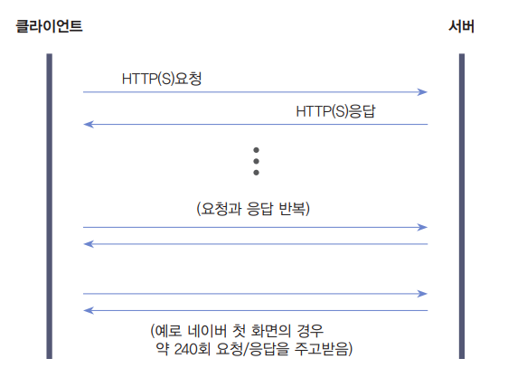

# HTTP 상태코드 

HTTP란 이름대로라면 하이퍼텍스트(Hypertext)만 전송할 수 있어 보이지만, 실제로는 HTML이나 XML과 같은 하이퍼텍스트뿐 아니라 이미지, 음성, 동영상, Javascript, PDF와 각종 문서 파일 등 컴퓨터에서 다룰 수 있는 데이터라면 무엇이든 전송할 수 있다.

예를 들어 우리가 웹 브라우저의 주소창에 https://www.naver.com을 입력하고 Enter 를 누르면 웹 클라이언트와 웹 서버 사이에 HTTP 연결이 맺어지고 웹 클라이언트는 웹 서버에 HTTP 요청 메시지를 보낸다. 웹 서버는 요청에 따른 처리를 진행한 후에 그 결과를 웹 클라이언트에 HTTP 응답 메시지로 보낸다. 이처럼 요청 메시지와 응답 메시지가 반복적으로 오가므로 우리는 웹을 사용할 수 있는 것이다.

서버에서의 처리 결과는 응답 메시지의 상태 라인에 있는 상태 코드(status code)를 보고 파악할 수 있다. 상태 코드는 세 자리 숫자로 되어 있는데 첫 번째 숫자는 HTTP 응답의 종류를 구분하는 데 사용하며 나머지 2개의 숫자는 세부적인 응답 내용 구분을 위한 번호이다.

현재 100~500번 대까지 상태 코드가 정의되어 있는데 첫 번째 자리 숫자에 따라 다음과 같이 5가지로 분류해서 사용하고 있다.

### 1XX: Informational(정보 제공)
임시 응답으로 현재 클라이언트의 요청까지는 처리되었으니 계속 진행하라는 의미이다. HTTP 1.1 버전부터 추가되었다.

- 100 Continue: 클라이언트가 요청을 계속 진행해도 좋다는 것을 의미한다. 클라이언트가 요청을 보내기 전에 서버가 준비되었음을 나타낸다.

### 2XX: Success(성공)
클라이언트의 요청이 서버에서 성공적으로 처리되었다는 의미이다.

- 200 OK: 요청이 성공적으로 처리되었음을 나타낸다. 일반적으로 GET 요청에 대한 성공적인 응답으로 사용된다.
- 201 Created: 요청이 성공적으로 처리되어 새로운 자원이 생성되었음을 의미한다. 주로 POST 요청에서 사용된다.
- 204 No Content: 요청이 성공했지만 반환할 콘텐츠가 없음을 나타낸다.

### 3XX: Redirection(리다이렉션)
완전한 처리를 위해서 추가 동작이 필요한 경우이다. 주로 서버의 주소 또는 요청한 URI의 웹 문서가 이동되었으니 그 주소로 다시 시도하라는 의미이다.

- 301 Moved Permanently: 요청한 자원이 다른 URI로 영구적으로 이동되었음을 의미한다. 클라이언트는 새로운 URI로 요청을 보내야 한다.
- 302 Found: 요청한 자원이 다른 URI로 일시적으로 이동되었음을 나타낸다. 클라이언트는 새로운 URI로 요청을 보낼 수 있지만, 원래의 URI를 유지해야 한다.
- 304 Not Modified: 클라이언트가 제공한 조건에 따라 자원이 변경되지 않았음을 의미한다. 클라이언트는 캐시된 데이터를 사용할 수 있다.

### 4XX: Client Error(클라이언트 에러)
없는 페이지를 요청하는 등 클라이언트의 요청 메시지 내용이 잘못된 경우를 의미한다.

- 400 Bad Request: 요청이 잘못되어 서버가 처리할 수 없음을 나타낸다. 클라이언트의 요청 문법에 문제가 있을 때 발생한다.
- 401 Unauthorized: 요청이 인증되지 않았음을 나타낸다. 클라이언트가 인증 정보를 제공해야 한다.
- 403 Forbidden: 서버가 요청을 이해했지만, 요청을 수행할 권한이 없음을 나타낸다.
- 404 Not Found: 요청한 자원을 찾을 수 없음을 의미한다. 클라이언트가 요청한 URL에 해당하는 자원이 존재하지 않을 때 발생한다.

### 5XX: Server Error(서버 에러)
서버 사정으로 메시지 처리에 문제가 발생한 경우이다. 서버의 부하, DB 처리 과정 오류, 서버에서 익셉션이 발생하는 경우를 의미한다.
 
- 500 Internal Server Error: 서버가 요청을 처리하는 중에 오류가 발생했음을 나타낸다. 서버의 내부 문제로 인해 요청을 처리할 수 없을 때 발생한다.
- 502 Bad Gateway: 서버가 다른 서버로부터 잘못된 응답을 받았음을 의미한다. 일반적으로 프록시 서버에서 발생할 수 있다.
- 503 Service Unavailable: 서버가 요청을 처리할 수 없는 상태임을 나타낸다. 일반적으로 서버가 과부하 상태이거나 유지보수 중일 때 발생한다.