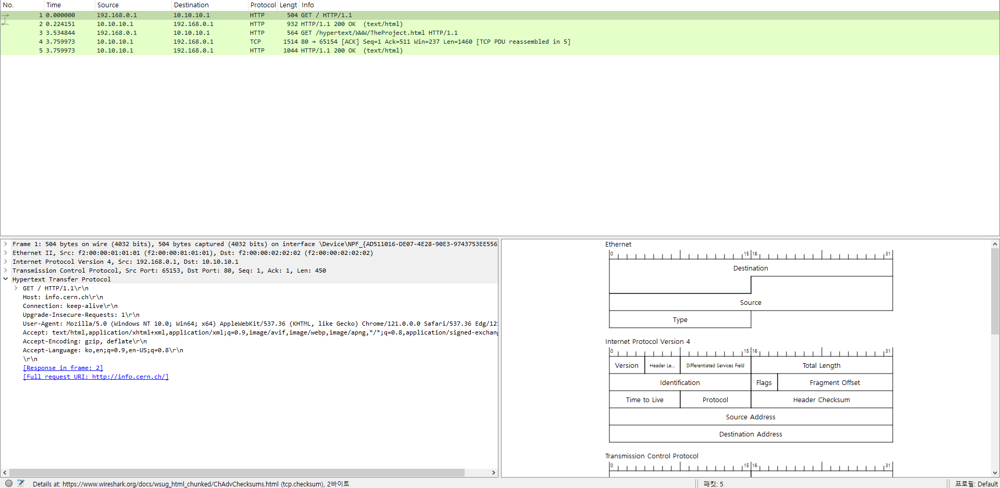

# HTTP

- TCP segment로 전달된 것의 정체는 HTTP protocol이다
- segment를 합쳐 http request를 만들고 이를 분석해서 application 계층에서 사용한다

## 분석

- 1:	0.000000	192.168.0.1	10.10.10.1	HTTP	504	GET / HTTP/1.1 
- 2:	0.224151	10.10.10.1	192.168.0.1	HTTP	932	HTTP/1.1 200 OK  (text/html)
- 3:	3.534844	192.168.0.1	10.10.10.1	HTTP	564	GET /hypertext/WWW/TheProject.html HTTP/1.1 
- 4:	3.759973	10.10.10.1	192.168.0.1	TCP	1514	80 → 65154 [ACK] Seq=1 Ack=511 Win=237 Len=1460 [TCP PDU reassembled in 5]
- 5:	3.759973	10.10.10.1	192.168.0.1	HTTP	1044	HTTP/1.1 200 OK  (text/html)

---

- \r\n을 splitter로 사용한다
    - \r는 carriage return(커서를 현재 행 앞으로 이동)
    - \n는 line feed(다음 행으로 커서를 이동)
- 헤더에 모든 정보가 들어있고, 실제 데이터는 body에 모두 들어있다
- 4번은 들어오는 http body가 너무 크니(용량) tcp segment로 나눠서 전송하고 그걸 합쳐서 http요청으로 만드는 것이다