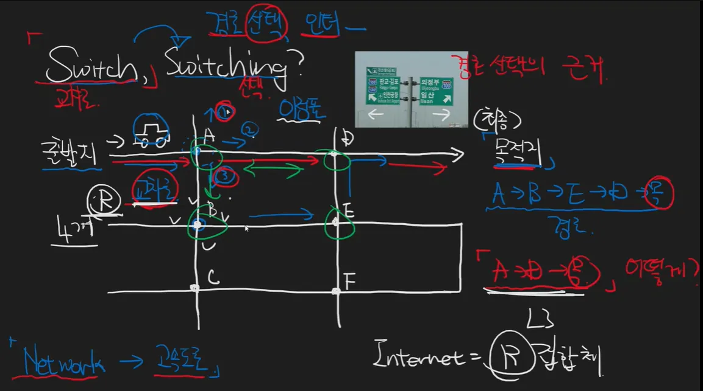

# 네트워크의 목표는 무엇인가?

> 네트워크는 라우터끼리 연결되어서 목표지점으로 이동시키는 것이다.

자동차는 패킷, 각 점은 라우터이다.

경로 선택의 근거는 어떻게? **라우팅 테이블(매우 중요)로 경로 선택을 한다.**

## 라우팅 테이블

> 라우팅 테이블(Routing Table)은 네트워크 장치, 특히 라우터가 패킷을 목적지까지 전송하기 위해 사용하는 데이터 구조이다. 이 테이블은 네트워크의 다양한 경로 정보를 포함하고 있으며, 패킷이 올바른 경로로 전송될 수 있도록 돕는다.

### 구성요소 

1. 목적지 네트워크(Destination Network) : 패킷이 도달해야 하는 네트워크의 주소를 나타낸다.
2. 서브넷 마스크(Subnet Mask): 목적지 주소와 함께 사용되어 특정 네트워크를 정의하는 데 사용된다. 이는 어떤 주소가 특정 네트워크에 속하는지를 결정하는 데 중요하다.
3. 넥스트 홉(Next Hop): 패킷을 다음으로 전달해야 할 장치의 IP 주소를 나타낸다. 즉, 패킷이 목적지로 가기 위해 가장 먼저 가야 할 라우터의 주소이다.
4. 인터페이스(Interface): 패킷을 전송하기 위해 사용될 네트워크 인터페이스의 식별자이다. 이는 라우터가 패킷을 전송하는 물리적 또는 가상 인터페이스를 나타낸다.
5. 메트릭(Metric): 각 경로의 효율성을 나타내는 값으로, 패킷을 전송할 때의 비용이나 거리 등을 기반으로 한다. 메트릭이 낮을수록 해당 경로가 우선적으로 선택된다.

### 무선 유선이 둘다 연결되있으면 무엇을 사용하는가?

라우팅 테이블에서 메트릭 값이 낮은 경로를 사용한다.