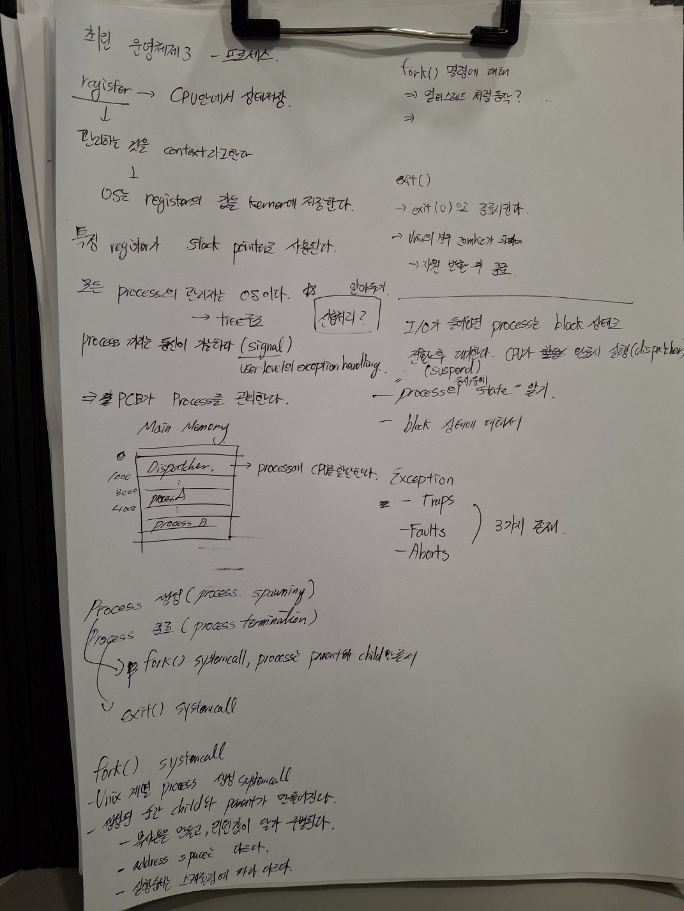

# 프로세스

## process state

# 프로세스 상태 (Process State)

## 1. 프로세스 상태 종류
운영체제에서 하나의 프로세스는 실행되는 동안 여러 가지 상태를 가질 수 있다. 대표적인 프로세스 상태는 다음과 같다.

### 1. New (생성)
- 프로세스가 생성된 상태로, 아직 실행을 준비하는 단계이다.
- 운영체제가 프로세스를 생성하고 필요한 자원을 할당하는 중이다.

### 2. Ready (준비)
- 프로세스가 CPU를 사용할 수 있는 상태이며, 실행을 기다리고 있다.
- 여러 개의 프로세스가 동시에 Ready 상태에 있을 수 있으며, CPU 스케줄러가 선택하면 실행된다.

### 3. Running (실행)
- 현재 CPU를 할당받아 실행 중인 상태이다.
- 단일 CPU 시스템에서는 한 번에 하나의 프로세스만 Running 상태가 될 수 있다.
- 실행 도중 인터럽트가 발생하거나 CPU 스케줄러에 의해 선점되면 다른 상태로 변경될 수 있다.
- 컨텍스트 스위칭을 이용해 여러 프로세스가 실행되는 것처럼 보일 수 있다. 하지만 어느 한 순간에는 오직 하나의 프로세스만 CPU를 점유할 수 있다, 즉 Running process는 언제나 한개이다(단일 CPU)

### 4. Waiting (대기)
- 프로세스가 특정 이벤트(예: 입출력 완료, 특정 조건 충족)를 기다리는 상태이다.
- CPU를 할당받아도 실행할 수 없는 상태이므로 대기 큐에 들어간다.
- 이벤트가 발생하면 다시 Ready 상태로 이동한다.

### 5. Terminated (종료)
- 프로세스가 실행을 완료하고 운영체제에 의해 제거된 상태이다.
- 정상 종료 또는 오류로 인해 종료될 수 있으며, 운영체제가 프로세스를 정리하고 할당된 자원을 회수한다.

---

## 2. 상태 전이 (State Transition)
프로세스는 다음과 같은 상태 전이를 거칠 수 있다.

- New → Ready : 프로세스가 생성되었으며 실행 준비가 완료됨.
- Ready → Running : CPU 스케줄러가 프로세스를 선택하여 실행함.
- Running → Ready : 실행 중이던 프로세스가 CPU를 양보하고 다시 대기열에 들어감 (예: 타임 슬라이스 만료).
- Running → Waiting : 프로세스가 입출력(I/O) 요청 등으로 인해 대기 상태로 전환됨.
- Waiting → Ready : 대기 중이던 이벤트가 발생하여 다시 실행 준비 상태가 됨.
- Running → Terminated : 프로세스가 실행을 끝마치고 종료됨.

---

## 3. 추가적인 상태
일부 운영체제에서는 추가적인 상태를 정의하기도 한다.

### Suspended (중지) / Blocked (차단)
- 프로세스가 메모리에서 제거되었지만, 나중에 다시 실행될 수 있는 상태이다.
- 운영체제가 메모리 부족 문제를 해결하기 위해 사용한다.

---

운영체제는 이러한 프로세스 상태를 관리하며 CPU 스케줄링과 자원 관리를 수행한다.
