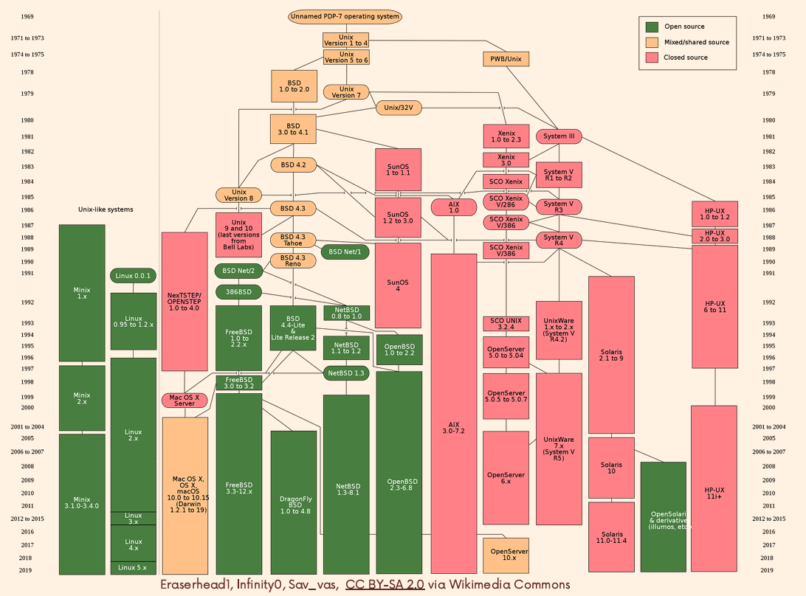
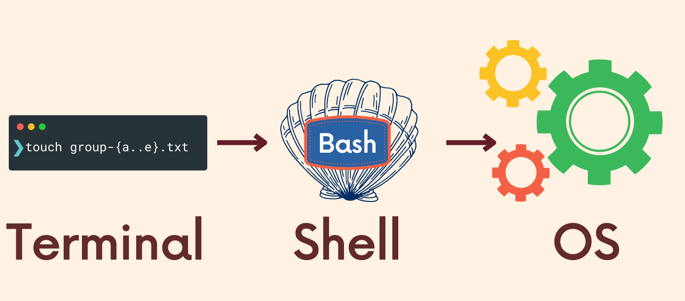

# 리눅스란?

> 운영체제가 아닌 커널, 오픈소스로 제공되며 다양한 배포판이 있다.(우분투(Ubuntu), 데비안(Debian))

- 리눅스 커널: 하드웨어와 소프트웨어를 연결하는 핵심 부분. 메모리 관리, 파일 시스템 관리, 프로세스 관리 등 중요한 기능을 담당한다.

- 리눅스 운영체제: 리눅스 커널과 이를 기반으로 한 유틸리티 및 응용 프로그램들의 집합체. 예를 들어, 우분투(Ubuntu)나 데비안(Debian) 같은 배포판은 리눅스 커널 위에 다양한 소프트웨어들이 결합된 형태이다.

## 배워야 하는 이유

1. 컴퓨터 핵심에 접근 가능
2. 자동화 가능
3. 빠르다
4. 다양한 기능 사용 가능
5. 보편성(대부분 어떤 운영체제든 사용 가능하다)

## 역사

- 다양한 오픈소스 vs 비오픈소스들이 범람할때 , GNU프로젝트와 Linux커널(프로젝트)가 합쳐져서 오픈소스로 만들어졌다.
- GNU 프로젝트의 목표 : Unix와 호환되는 완전한 자유(무료가 아닌, 자유롭게 사용할 수 있는 것) 소프트웨어 운영체제를 만드는 것
- Linux 커널 : 처음에 개인적인 프로젝트로 리눅스를 시작했지만, 커널을 오픈소스로 공개하며 전 세계 개발자들이 함께 참여하게 되었다.
- Linux는 UNIX-like 계열에 속한다.
   - True-UNIX(많은 시간, 돈을 들여서 엄격한 UNIX체제의 인증을 받아서 UNIX로 인증받은 것)
   - UNIX-like(UNIX에서 영향을 받아 제작한것, 인증을 받지는 않았다. UNIX 시스템과 비슷한 명령어 체계와 구조를 갖추고 있다.)

## 터미널과 쉘, OS

- 터미너는 쉘을 실행하는 어플리케이션이다.
- 터미널의 명령어는 쉘로 넘어가 운영체제가 실행할 수 있는 명령이 되어 실행된다.
- 파이썬의 코드입력 -> 인터프리터를 통한 해석 -> 코드 실행과 유사한 과정이다.
- 쉘은 default 는 BASH이다.

## windwos에서 사용법

- Virtual Box 이용
- WSL2 이용

### 두 방식의 차이점
1. 가상화 방식: VirtualBox는 하드웨어 가상화 기술을 사용하여 전체 운영체제를 가상 머신으로 실행하지만, WSL은 Windows 내부에서 리눅스 커널을 직접 실행하는 방식이다.
2. 리소스 사용: VirtualBox는 독립된 가상 환경을 제공하므로 더 많은 시스템 리소스를 소모하는 반면, WSL은 리소스를 적게 사용한다.
3. 운영체제: VirtualBox는 다양한 운영체제를 독립적으로 실행할 수 있지만, WSL은 리눅스만 지원한다.
4. 성능: WSL은 가상화 오버헤드가 없어 성능이 더 뛰어난 경우가 많고, VirtualBox는 가상화로 인한 성능 저하가 있을 수 있다.
5. 사용 용도: VirtualBox는 완전한 가상 환경을 필요로 하는 경우에 적합하고, WSL은 Windows와 리눅스를 동시에 사용하려는 개발자에게 적합하다.