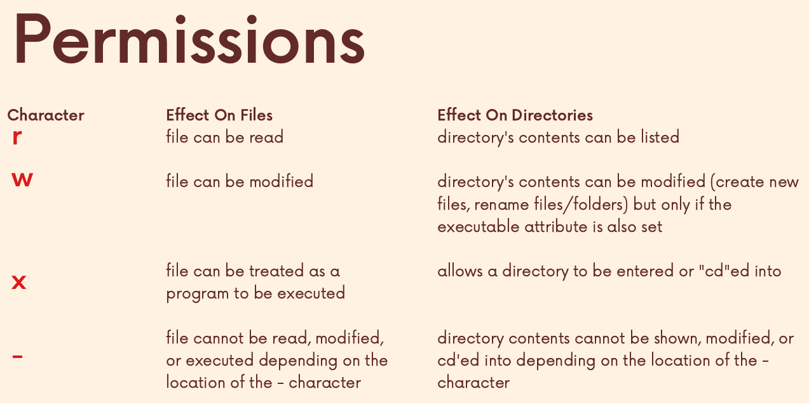

# 권한

- Unix와 Unix-like 시스템은 multiuser operating system이다.

- 사용자 계정도 여러개고, 이러한 사용자들이 동시에 로그인 할 수도 있다.

## 파일 소유자와 그룹 소유자

### 파일 소유자 (Owner)
- 파일을 생성한 사용자로 기본적으로 소유자가 된다.
    - 파일 또는 디렉터리에 대한 권한(읽기, 쓰기, 실행)을 독립적으로 가질 수 있다.
    - 다른 사용자와 비교해 더 높은 권한을 가질 수 있다.
    - 소유자는 필요에 따라 다른 사용자로 변경 가능하다. (chown 명령 사용)
### 그룹 소유자 (Group Owner)
- 파일이 속한 그룹을 의미한다.
    - 그룹에 속한 모든 사용자에게 권한이 적용된다.
    - 그룹 멤버는 그룹 소유자 권한에 따라 파일에 접근할 수 있다.
    - 그룹 소유자는 변경 가능하다. (chgrp 명령 사용)
### 예시
```bash
gunha@oracle:~$ ls -l
-rw-r--r--  1 alice  developers  1024 Dec 26 12:00 example.txt

...
```
- alice: 파일 소유자
- developers: 그룹 소유자

### File Attributes


#### 예시
```bash
-rwxr-xr--
```
- 파일 권한은 세 가지로 구분된다
    - 소유자 (Owner)
    - 그룹 (Group)
    - 기타 사용자 (Others)
- 첫 번째 세트(rwx): 소유자 권한
- 두 번째 세트(r-x): 그룹 소유자 권한
- 세 번째 세트(r--): 기타 사용자 권한



- rwx(read, write, execute)는 순서대로 읽기,쓰기,실행권한을 의미한다.
- 첫번째 글자는 file type을 의미한다.
    - `-` : regular file
    - `d` : directory
    - `c` : character special file
    - `l` : symbolic link
    - `b` : block 디바이스, block 특수파일
- `x` 의 의미는 파일이 실행 가능한 파일이고, 프로그램으로 실행이 가능하다는 뜻이다.
    - `date` 명령어는 사실 `/bin` 에 있는 date라는 이름의 파일(스크립트)를 실행시키는 것이다.
    - `x` 권한을 제거한다면 다른 사용자들이 해당 명령어를 사용할 수 없게 된다.