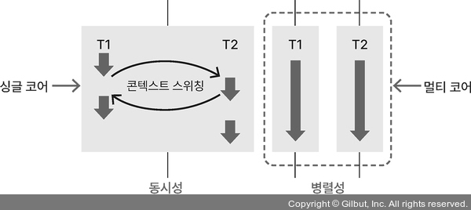
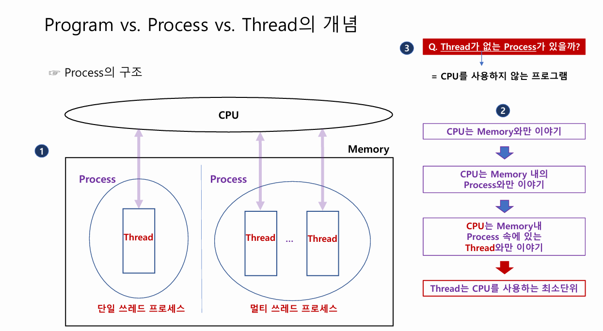
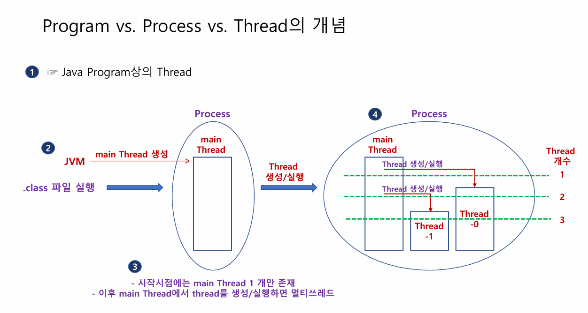

# Process

> 프로세스는 실행 중인 프로그램의 인스턴스로, 시스템에서 독립적으로 실행될 수 있는 기본 단위이다. 각 프로세스는 자신만의 메모리 공간을 가지며, 코드, 데이터, 스택, 힙 등을 포함한다.

> 프로그램은 코드 덩어리 파일, 그 프로그램을 실행한 게 프로세스

## 특징

- 독립성: 각 프로세스는 서로 독립적으로 실행되며, 하나의 프로세스가 실패하더라도 다른 프로세스에는 영향을 미치지 않는다.
- 자원 할당: 운영체제는 각 프로세스에 CPU, 메모리, 파일 등의 자원을 할당한다.
- 문맥 전환: 프로세스 간에 전환할 때는 프로세스의 상태를 저장하고 복원하는 문맥 전환이 필요하다. 이는 상대적으로 비용이 크다.

# Thread

> 스레드는 프로세스 내에서 실행되는 흐름의 단위로, 같은 프로세스 내의 다른 스레드와 메모리와 자원을 공유한다. 스레드는 경량 프로세스(lightweight process)라고도 불린다.

## 특징

- 공유 자원: 같은 프로세스 내의 스레드는 메모리 공간을 공유하기 때문에, 데이터를 빠르게 교환할 수 있다.
- 독립적인 실행: 스레드는 독립적으로 실행될 수 있지만, 같은 프로세스 내의 다른 스레드와 자원을 공유하므로, 하나의 스레드에서 발생한 문제(예: 예외)가 다른 스레드에도 영향을 줄 수 있다.
- 빠른 문맥 전환: 스레드 간의 문맥 전환은 프로세스 간 전환보다 비용이 적다. 메모리 공간을 공유하기 때문에 상태 저장이 간단하다.

# 멀티태스킹과 멀티스레드

## 멀티태스킹 
> 멀티태스킹은 여러 프로세스가 동시에 실행되는 것"처럼" 보이게 하는 운영체제의 기능이다. 운영체제는 CPU 시간을 각 프로세스에 나누어 주며, 이 과정에서 각 프로세스의 상태를 저장하고 복원하는 문맥 전환을 수행한다.

> 현대의 운영체제는 여러 가지 일을 동시에 돌릴 수 있게 하는데, 기본적인 원리는 단순하다. 한 가지 일을 하다가, 잠시 멈추고 또 다른 일을 하고, 또 멈추고 다른 일을 하다 보면 언젠가는 결국 모든 일을 마치게 된다. 이 동작이 엄청 빨라지면 한 번에 여러 가지 일을 하는 것처럼 보이게 되는 것이다. 그림 여러 장을 그려놓고 빠르게 연속 재생하면 눈에 잔상이 남아 그것이 움직여 보이는 것처럼, 한 개체가 여러 가지 동작을 매우 빠르게 하면 그것이 분신술처럼 보이게 되는 것이 바로 멀티태스킹의 원리이다. 유저 프로그램들은 마치 동시에 실행되는 것처럼 보이지만, 커널 내부에서는 운영체제가 각각의 프로그램에 CPU 사용권을 적절히 분배하는 작업이 반복되고 있다. 하드웨어 자원은 한정되어 있는데 멀티태스킹을 위해 더 많은 작업을 바쁘게 수행해야 하므로 어느 특정 프로그램 하나가 실행할 때 다른 여러 프로그램들과 함께 실행할 때가 실행하지 않을 때보다 더 느릴 수밖에 없지만, 블로킹 상태를 자주 보면서 작업하는 것보단 훨씬 나은 UX를 제공할 수 있기 때문에 멀티태스킹이 정착하게 된 것이다. 보다 효율적인 멀티태스킹이 되기 위해서는 프로세스들을 적절히 분배하는 작업이 이루어져야 하는데 이러한 작업을 프로세스 스케줄링이라고 한다.
 

> 최신 리눅스 커널의 경우 보통 한 프로세스에 4ms(4/1000초)간 CPU 사용권을 부여한다고 한다. 밀리초 단위라서 짧게 느껴질지도 모르겠지만, 3~5 GHz 정도의 속도로 동작하는 요즘 일반 데스크탑용 CPU는 4ms면 1천 2백만~2천만 번 정도의 클럭 사이클을 만들어서 최소 수 백만 번 이상의 연산을 수행할 수 있다. 사람으로 치면 4년이라는 매우 긴 시간을 부여하는 것이다.

## 멀티스레드
> 스레드는 CPU에서 사용하는 하드웨어 스레드와 프로그래밍 운영체제에서 사용하는 소프트웨어 스레드로 나뉘어져 있다.

> 하드웨어 스레드란 하나의 코어가 동시에 처리하는 명령어의 단위를 의미한다.

> 소프트웨어 스레드란 동시성을 구현하기 위한 소프트웨어의 논리적인 실행 단위이다.

> 결국, JAVA에서의(소프트웨어 수준의) 스레드란 비동기작업의 단위를 만드는 방법이다.(멀티코어 CPU를 사용하고 있다면 실제로 작업이 병렬로 진행된다.)

### 병렬성

> CPU가 코어를 통해 물리적으로 동시에 실행되는 것

> 동시에 실행되는 것처럼 보이는 것이 아닌(동시성) 실제로 동시에 실행되는 것

### 동시성

> 소프트웨어에서 동시에 실행되는 것 '처럼' 보이게 하는 것
> / 빠르게 스위칭해서 동시에 실행하는 것 처럼 보이게 한다.(동시에 일어나진 않는다, 코어수가 부족한 상황이기 때문에)

> 멀티코어 환경이라면 실제로 동시에 실행된다.

### 특징

- 자원 공유: 같은 프로세스 내의 스레드는 메모리와 자원을 공유하므로 데이터의 교환이 빠르다.
- 경량성: 스레드는 프로세스보다 경량화되어 있어, 문맥 전환이 더 빠르다.
- 동기화 필요: 스레드가 자원을 공유하기 때문에, 데이터 무결성을 보장하기 위해 동기화 메커니즘(예: 뮤텍스, 세마포어 등)이 필요하다.

