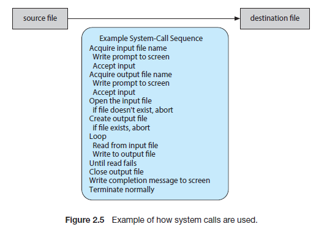

# System Call

> 시스템 호출(System Call)은 응용 프로그램이 운영 체제의 서비스에 접근하기 위해 사용하는 메커니즘이다. 이는 프로세스가 파일 작업, 메모리 관리, 프로세스 제어 등의 기능을 수행할 수 있도록 도와준다. 시스템 호출은 사용자 모드에서 커널 모드로 전환하며, 이 과정에서 운영 체제는 요청된 작업을 수행하고 결과를 응용 프로그램에 반환한다. 시스템 호출은 프로그램의 하드웨어 자원 관리와 보안을 효율적으로 처리하는 데 중요한 역할을 한다.

- 결국 시스템 콜이라는거는 컴퓨터의 특정 컴퓨터를 정의 해놓은 함수이다
    - 시스템 콜(System Call)은 운영 체제가 제공하는 함수로, 컴퓨터의 특정 기능(주로 하드웨어 자원 관리와 관련된 기능)을 호출하기 위해 정의된 인터페이스다.

- 함수(특히 시스템 콜)로 제공되는 기능이 필요하지만, 더 세밀한 조정이 필요한 경우가 많다. 이런 상황에서는 시스템 콜의 기본 기능을 보완하거나 확장할 수 있는 다양한 방법이 사용된다.

## 기존 시스템 콜과 결합된 라이브러리 사용
- 시스템 콜이 제공하는 기본적인 기능을 조합하거나 확장해주는 고수준의 라이브러리 함수를 활용할 수 있다.

- 예를 들어, C 표준 라이브러리(glibc)는 open, read 같은 시스템 콜을 더 세밀하게 조정한 기능을 제공한다.
- 예시: 파일 작업에서 단순히 데이터를 읽고 쓰는 대신, fseek, fprintf 같은 고수준 함수를 사용해 더 정교한 작업을 수행.
## 커널 패치와 새로운 시스템 콜 추가
- 기존 시스템 콜이 완전히 부족한 경우, 커널 코드를 수정하거나 새로운 시스템 콜을 추가할 수 있다.
- 이는 매우 높은 수준의 기술이 필요하며, 커널 빌드와 테스트를 거쳐야 한다.
- 예: 특정 하드웨어나 플랫폼에 맞는 시스템 콜이 없는 경우 이를 직접 추가.
- 등 여러 방법을 통해 문제를 해결 할 수 있다.


## 왜 필요한가?

 우리가 일반적으로 사용하는 프로그램은 '응용프로그램'이다. 유저레벨의 프로그램은 유저레벨의 함수들 만으로는 많은 기능을 구현하기 힘들기 때문에, 커널(kernel)의 도움을 반드시 받아야 한다. 이러한 작업은 응용프로그램으로 대표되는 유저 프로세스에서 유저모드에서는 수행할 수 없다. 반드시 kernel에 관련된 것은 커널모드로 전환한 후에야, 해당 작업을 수행할 권한이 생긴다. 커널 모드를 통한 이러한 작업은 반드시 system call을 통해 수행하도록 설계되어 있다.


## System Call 예제

```linux

    cp in.txt out.txt

```

리눅스 터미널에 위와 같은 명령어를 입력한다면 이때 순차적으로 호출되는 시스템 콜은 어떤 것이 있을까? 위의 문장은 in.txt에 있는 파일내용과 같은 내용을 복사하여 out.txt 파일을 만드는 것이다.<br>
일반적으로 윈도우 운영체제라면 라면 마우스가, 리눅스라면 키보드가 사용자로부터 입력을 받는데 이때 I/O 시스템 콜을 사용한다. 위와 같은 문장을 입력을 받아서 'cp' 프로그램을 실행시키면 먼저 'in.txt' 파일이 현재 디렉터리에서 접근할 수 있는 파일인지를 검사하기 위해 시스템 콜을 호출한다. 만약 파일이 존재하지 않는다면 애러를 발생시키고 프로그램을 종료하는데 이때 시스템 콜이 사용된다. <br>만약 파일이 존재한다면, 복사한 파일을 저장하기 위해 'output.txt' 파일명이 있는지 검사한다. <br>그리고 이 때도 마찬가지로 이 파일명이 존재하는지 존재하지 않는지 검사하기 위해 시스템 콜을 통해 확인한다.<br> 그리고 만약 파일 명이 이미 존재한다면 덮어 씌워야 할지 아니면 이어서 붙여야 하는지 User에게 물어볼 수 있다. 만약 저장하고자 하는 파일 이름이 겹치지 않다면, 파일을 저장해야 하는데 이 때도 시스템 콜을 이용한다.



## System Call의 Window 예제

> 윈도우 운영 체제는 C 언어와 어셈블리어를 사용하여 개발되었다. C 언어는 시스템 프로그래밍에 적합한 고급 언어로, 운영 체제와 같은 복잡한 소프트웨어를 구현하는 데 널리 사용된다. 윈도우의 핵심 부분은 주로 C로 작성되었으며, 성능이 중요한 부분에서는 어셈블리어가 사용되기도 한다.

> 윈도우의 커널, 드라이버 및 시스템 라이브러리 등 대부분의 시스템 구성 요소가 C 언어로 작성되었다. C 언어는 저수준 메모리 조작이 가능하여 하드웨어와 밀접하게 작업할 수 있는 장점이 있다.

> CreateFile 시스템 호출 : 이 호출은 파일이나 디렉토리를 생성하거나 기존 파일을 여는 데 사용된다.


``` C

#include <windows.h>
#include <stdio.h>

int main() {
    // 파일 생성 및 열기
    HANDLE hFile = CreateFile(
        "example.txt",          // 생성할 파일의 이름
        GENERIC_WRITE,         // 파일에 쓸 수 있는 권한 요청
        0,                     // 공유 모드 설정 (여기서는 공유 안 함)
        NULL,                  // 보안 속성 (기본값 사용)
        CREATE_ALWAYS,        // 파일이 이미 존재할 경우 덮어씀
        FILE_ATTRIBUTE_NORMAL, // 일반 파일로 설정
        NULL                   // 템플릿 파일 핸들 (사용 안 함)
    );

    // 파일 핸들 생성 성공 여부 확인
    if (hFile == INVALID_HANDLE_VALUE) {
        printf("파일을 열 수 없습니다. 에러 코드: %d\n", GetLastError());
        return 1; // 오류 발생 시 종료
    }

    // 파일에 데이터 쓰기
    const char *data = "Hello, World!";
    DWORD bytesWritten;
    WriteFile(hFile, data, strlen(data), &bytesWritten, NULL);

    // 파일 핸들 닫기
    CloseHandle(hFile);
    printf("파일이 성공적으로 생성되었습니다.\n");

    return 0; // 정상 종료
}

```


- CreateFile: 지정된 파일을 생성하거나 열기 위해 호출하는 함수이다. 이 함수는 파일 핸들을 반환하며, 성공 시 유효한 핸들을 반환하고 실패 시 INVALID_HANDLE_VALUE를 반환한다.
- GENERIC_WRITE: 파일에 쓰기 권한을 요청하는 플래그이다.
- CREATE_ALWAYS: 파일이 존재하는 경우에도 항상 새로운 파일로 생성하여 덮어쓴다는 의미이다.
- FILE_ATTRIBUTE_NORMAL: 일반 파일 속성을 의미하며, 추가적인 속성이 없음을 나타낸다.
- WriteFile: 열린 파일 핸들을 통해 데이터를 파일에 쓸 때 사용하는 함수이다.
- CloseHandle: 사용이 끝난 파일 핸들을 닫아 시스템 리소스를 해제하는 함수이다.

