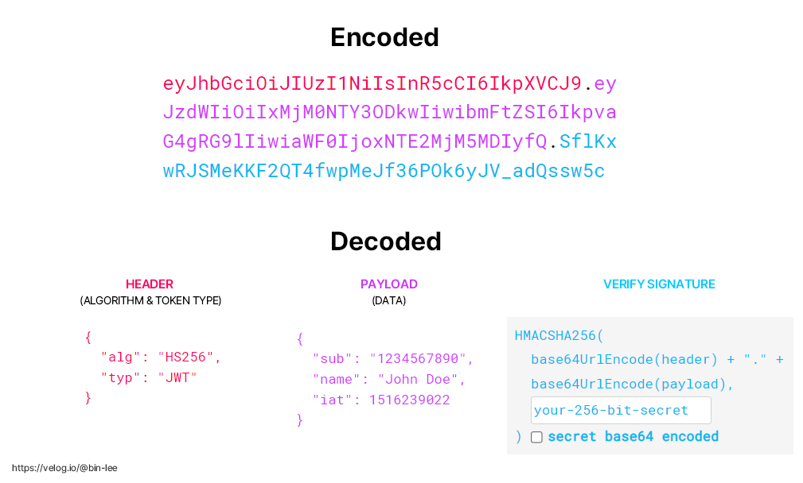
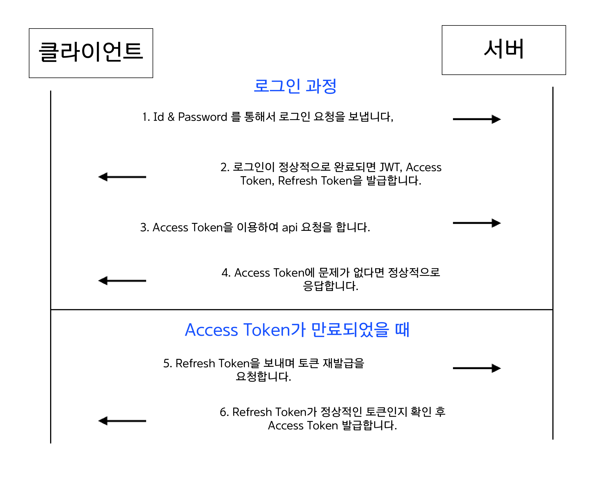
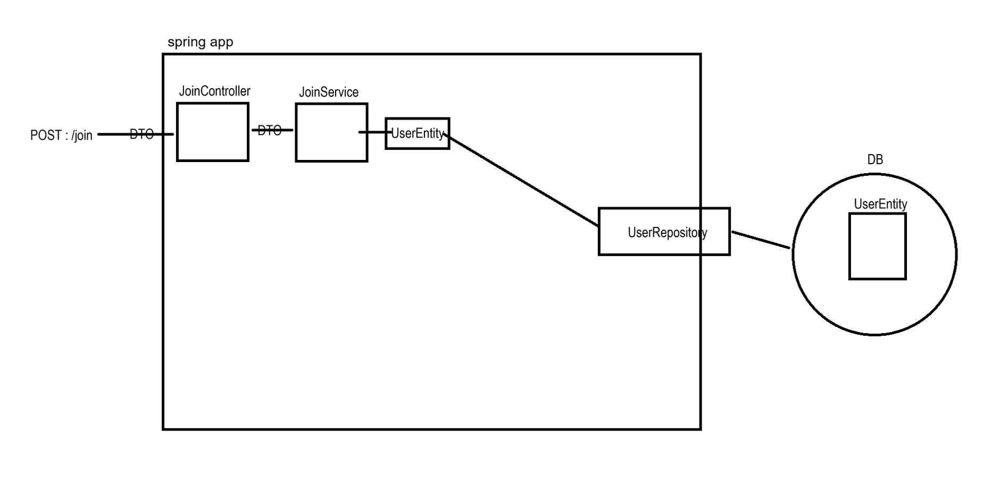
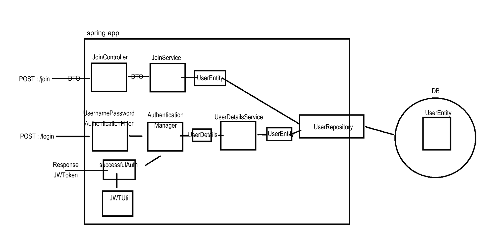
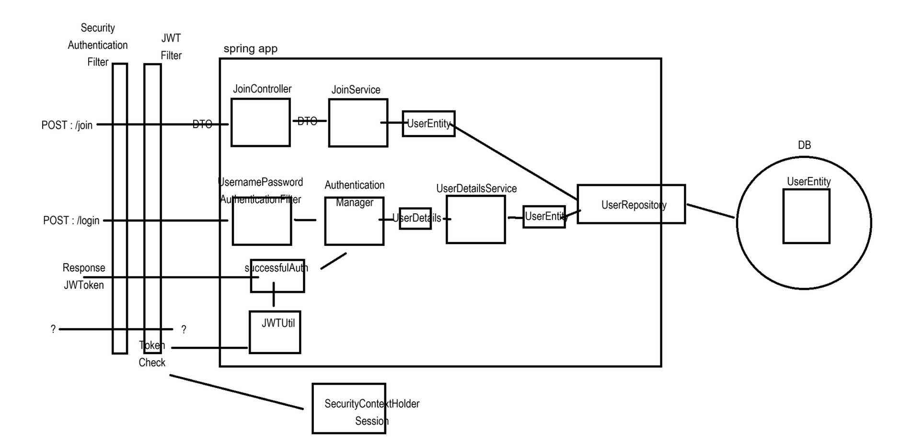

# JWT

## JWT란?

JWT(JSON Web Token)란 인증에 필요한 정보들을 암호화시킨 JSON 토큰을 의미한다. 그리고 JWT 기반 인증은 JWT 토큰(Access Token)을 HTTP 헤더에 실어 서버가 클라이언트를 식별하는 방식이다

JWT는 JSON 데이터를 Base64 URL-safe Encode 를 통해 인코딩하여 직렬화한 것이며, 토큰 내부에는 위변조 방지를 위해 개인키를 통한 전자서명도 들어있다. 따라서 사용자가 JWT 를 서버로 전송하면 서버는 서명을 검증하는 과정을 거치게 되며 검증이 완료되면 요청한 응답을 돌려준다.

### JWT의 구조

- Header와 Payload는 단순히 인코딩된 값이기 때문에 제 3자가 복호화 및 조작할 수 있지만, Signature는 서버 측에서 관리하는 비밀키가 유출되지 않는 이상 복호화할 수 없다. 따라서 Signature는 토큰의 위변조 여부를 확인하는데 사용된다.

### JWT를 이용한 인증 과정

### JWT의 Access Token / Refresh Token

 JWT도 제 3자에게 토큰 탈취의 위험성이 있기 때문에, 그대로 사용하는것이 아닌 Access Token, Refresh Token 으로 이중으로 나누어 인증을 하는 방식을 현업에선 취한다.
Access Token 과 Refresh Token은 둘다 똑같은 JWT이다. 다만 토큰이 어디에 저장되고 관리되느냐에 따른 사용 차이일 뿐이다.

- Access Token : 클라이언트가 갖고있는 실제로 유저의 정보가 담긴 토큰으로, 클라이언트에서 요청이 오면 서버에서 해당 토큰에 있는 정보를 활용하여 사용자 정보에 맞게 응답을 진행

- Refresh Token: 새로운 Access Token을 발급해주기 위해 사용하는 토큰으로 짧은 수명을 가지는 Access Token에게 새로운 토큰을 발급해주기 위해 사용. 해당 토큰은 보통 데이터베이스에 유저 정보와 같이 기록.

정리하자면, Access Token은 접근에 관여하는 토큰, Refresh Token은 재발급에 관여하는 토큰의 역할로 사용되는 JWT 이라고 말할 수 있다.

## Spring Security에서 JWT를 사용하는 방법

- 회원가입 : 내부 회원 가입 로직은 세션 방식과 JWT 방식의 차이가 없다.

- 로그인 (인증) : 로그인 요청을 받은 후 세션 방식은 서버 세션이 유저 정보를 저장하지만 JWT 방식은 토큰을 생성하여 응답한다.

- 경로 접근 (인가) : JWT Filter를 통해 요청의 헤더에서 JWT를 찾아 검증을하고 일시적 요청에 대한 Session을 생성한다. (생성된 세션은 요청이 끝나면 소멸됨)

