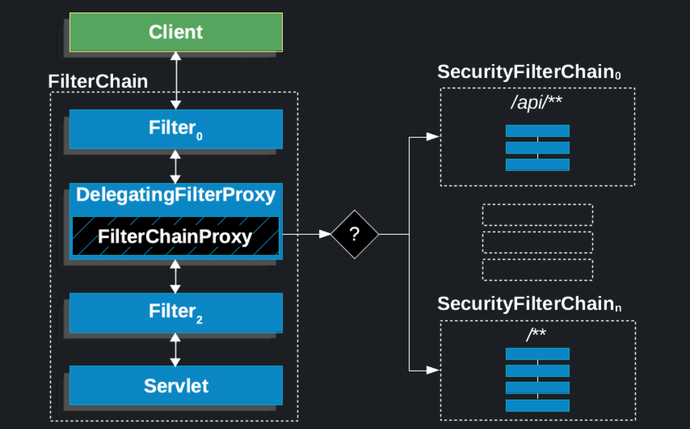
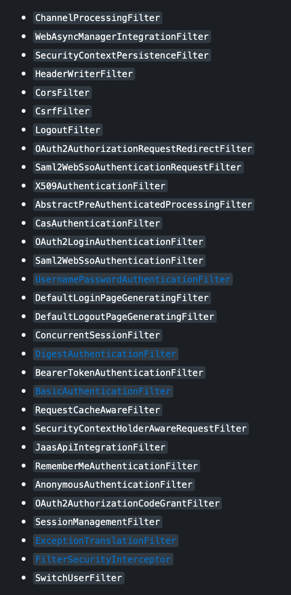

# spring Security 흐름

- spring security flow는 다음 그림과 같다.

---

- 스프링 시큐리티는 클라이언트의 요청이 여러개의 필터를 거쳐 DispatcherServlet(Controller)으로 향하는 중간 필터에서 요청을 가로챈 후 검증(인증/인가)을 진행한다.

- 클라이언트 요청 → 서블릿 필터 → 서블릿 (컨트롤러)

--- 

- Delegating Filter Proxy
    - spring security는 서블릿 컨테이너(톰캣)에 존재하는 필터 체인에 DelegatingFilter를 등록한 뒤 모든 요청을 가로챈다.

---

- 서블릿 필터 체인의 DelegatingFilter → Security 필터 체인 (내부 처리 후) → 서블릿 필터 체인의 DelegatingFilter
    - 가로챈 요청은 SecurityFilterChain에서 처리 후 상황에 따른 거부, 리디렉션, 서블릿으로 요청 전달을 진행한다.

---

- SecurityFilterChain의 필터 목록과 순서 
    - 모든 필터가 활성화되지는 않는다.

## 요약 

### 기본 설정
- `/login` 으로 요청이 들어오면 기본 설정인 Form 로그인 방식에서는 클라이언트단이 username과 password를 전송한 뒤 Security 필터를 통과하는데 UsernamePasswordAuthentication 필터에서 회원 검증을 진행한다.
    -  UsernamePasswordAuthenticationFilter가 호출한 AuthenticationManager를 통해 진행하며 DB에서 조회한 데이터를 UserDetailsService를 통해 받음
    - 인증 과정에서 UserDetailsService가 사용되며, 이는 DB에서 사용자 정보를 조회하여 UserDetails 객체를 반환한다.
    - UserDetails 객체는 UserDetailsService를 통해 제공되며, 이는 Spring Security가 인증을 처리하는 데 필요한 사용자 정보(예: 사용자 이름, 비밀번호, 권한 등)를 담고 있다.
### form disable
- 기본 설정인 form을 config에서 disable하면 때문에 기본적으로 활성화 되어 있는 해당 필터는 동작하지 않는다.
- 따라서 로그인을 진행하기 위해서 필터를 커스텀필터를 구현해야한다.
    - 해당 필터는 `UsernamePasswordAuthenticationFilter` 를 상속받아 구현 할 수 있다.
    - 상속받은 클래스는 `attemptAuthentication` 메소드를 오버라이딩해 인증로직을 작성해야한다
    - 상속받은 클래스는 `successfulAuthentication` , `unsuccessfulAuthentication` 를 오버라이딩해 성공과 실패시 행동(JWT or Logic)을 구현해야한다.
- 상속 받은 것을 오버라이딩하면 기본 동작은 form과 같다. 이후 동작은 UsernamePasswordAuthenticationFilter가 호출한 AuthenticationManager를 통해 진행하며 DB에서 조회한 데이터를 UserDetailsService를 통해 받으며, UserDetails를 DTO로 이용한다.